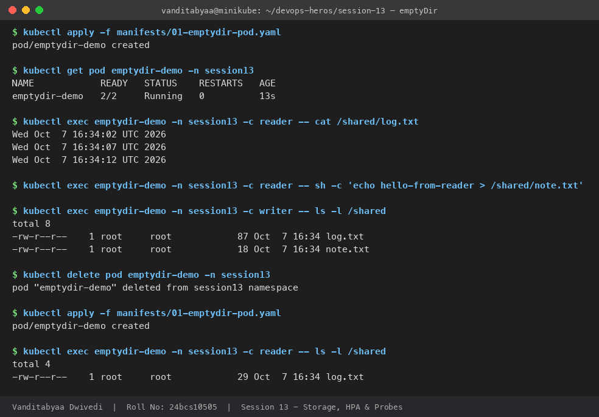
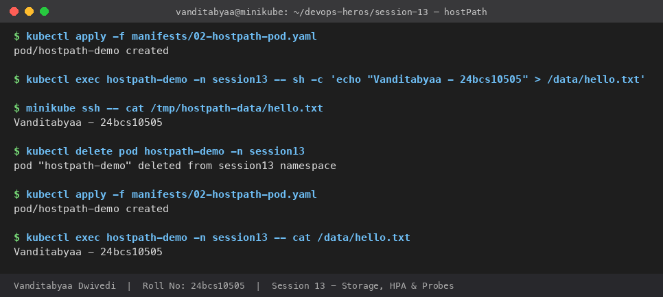
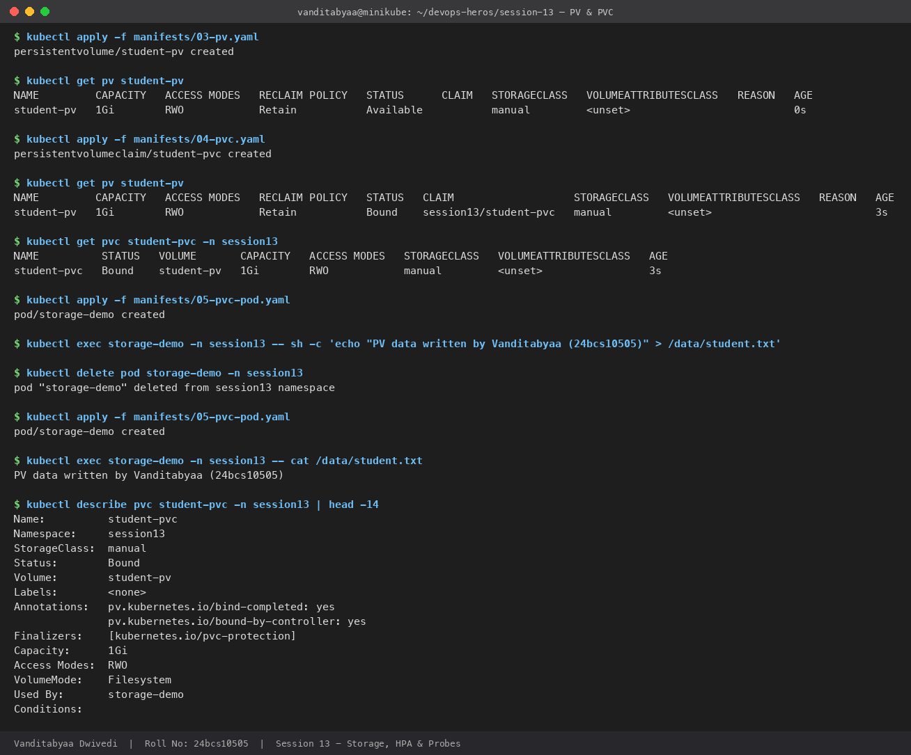
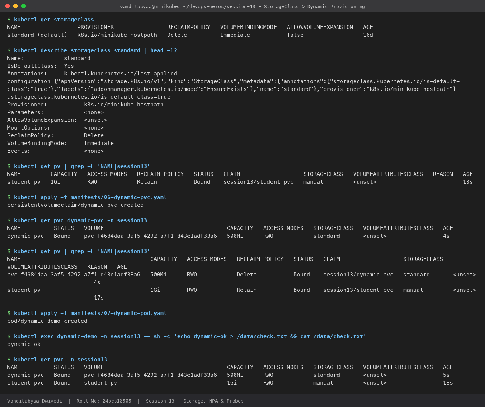

# Task 1: Kubernetes Volumes

| | |
|---|---|
| **Name** | Vanditabyaa Dwivedi |
| **Roll No.** | 24bcs10505 |
| **Session** | 13: Kubernetes Storage, HPA & Probes |
| **Cluster** | Minikube (Kubernetes v1.37.0, containerd) |

All examples below were run on my Minikube cluster in a dedicated `session13` namespace. The YAML is in [`manifests/`](manifests/), the raw command output is in [`outputs/`](outputs/) and the screenshots are in [`screenshots/`](screenshots/).

```bash
kubectl apply -f manifests/00-namespace.yaml
```

---

## Why do we need volumes?

A container's filesystem is **ephemeral**. When a container restarts or a Pod is deleted, everything written inside it is lost. Volumes give containers storage that:

- can be **shared** between containers in the same Pod, and/or
- can **outlive** the container or even the Pod.

Kubernetes offers several kinds of volumes, from short-lived scratch space up to network or cloud disks that are provisioned automatically.

```text
Short-lived  ─────────────────────────────────────────────▶  Long-lived
emptyDir          hostPath           PV + PVC            StorageClass (dynamic)
(Pod lifetime)    (Node lifetime)    (Cluster object)    (auto-created PVs)
```

---

## 1. emptyDir

**What it is:** An empty directory created when a Pod is scheduled on a node. All containers in the Pod can read and write it. **When the Pod is deleted, the data is deleted too.** It survives a container *restart*, but not Pod deletion.

**Use cases:** Scratch space, caches, sharing files between a main container and a sidecar (for example a log shipper).

**Manifest:** [`manifests/01-emptydir-pod.yaml`](manifests/01-emptydir-pod.yaml). The `writer` container appends the date to a file every 5 seconds, and the `reader` container mounts the same volume.

```yaml
volumes:
  - name: shared-data
    emptyDir: {}
```

**What I did and saw:**

1. The `reader` container could read `log.txt`, which was written by the `writer` container, so **the volume is shared**.
2. I created `note.txt` from `reader` and it was visible from `writer`.
3. I deleted and recreated the Pod. `note.txt` was gone and `log.txt` had started over, so **the data died with the Pod**.

```text
$ kubectl exec emptydir-demo -n session13 -c writer -- ls -l /shared
-rw-r--r--    1 root     root            87 Oct  7 16:34 log.txt
-rw-r--r--    1 root     root            18 Oct  7 16:34 note.txt

$ kubectl delete pod emptydir-demo -n session13
$ kubectl apply -f manifests/01-emptydir-pod.yaml
$ kubectl exec emptydir-demo -n session13 -c reader -- ls -l /shared
-rw-r--r--    1 root     root            29 Oct  7 16:34 log.txt      <- note.txt is gone
```



> **Tip:** `emptyDir: { medium: Memory }` uses a RAM-backed tmpfs instead of disk. It is faster, but it counts against the container's memory limit.

---

## 2. hostPath

**What it is:** Mounts a file or directory from the **node's filesystem** into the Pod. The data outlives the Pod, but it is tied to **that one node**. If the Pod is rescheduled onto a different node, it sees a different (empty) directory.

**Use cases:** Node-level system agents (log collectors reading `/var/log`, monitoring agents), and single-node dev clusters.

**Risks:** Gives the Pod access to the host's filesystem, which is a security risk. It isn't portable across nodes, so avoid it for application data in production.

**Manifest:** [`manifests/02-hostpath-pod.yaml`](manifests/02-hostpath-pod.yaml)

```yaml
volumes:
  - name: host-storage
    hostPath:
      path: /tmp/hostpath-data
      type: DirectoryOrCreate   # create the directory on the node if missing
```

**What I did and saw:** I wrote a file from inside the Pod and then read it **directly from the Minikube node** with `minikube ssh`. After deleting and recreating the Pod, the file was still there.

```text
$ kubectl exec hostpath-demo -n session13 -- sh -c 'echo "Vanditabyaa - 24bcs10505" > /data/hello.txt'
$ minikube ssh -- cat /tmp/hostpath-data/hello.txt
Vanditabyaa - 24bcs10505
$ kubectl delete pod hostpath-demo -n session13 && kubectl apply -f manifests/02-hostpath-pod.yaml
$ kubectl exec hostpath-demo -n session13 -- cat /data/hello.txt
Vanditabyaa - 24bcs10505
```



---

## 3. PersistentVolume (PV)

**What it is:** A **cluster-level** piece of storage, usually created by an administrator (or automatically, see section 5). It is a Kubernetes object with its own lifecycle, **independent of any Pod**. It describes:

- **capacity**, for example `1Gi`
- **accessModes**:
  - `ReadWriteOnce` (RWO): read-write by a single node
  - `ReadOnlyMany` (ROX): read-only by many nodes
  - `ReadWriteMany` (RWX): read-write by many nodes
  - `ReadWriteOncePod` (RWOP): read-write by a single Pod
- **persistentVolumeReclaimPolicy**:
  - `Retain`: keep the data after the claim is deleted
  - `Delete`: delete the underlying storage too
- **the backend**, for example `hostPath`, NFS, an AWS EBS volume or a GCE disk

**Manifest:** [`manifests/03-pv.yaml`](manifests/03-pv.yaml)

```yaml
apiVersion: v1
kind: PersistentVolume
metadata:
  name: student-pv
spec:
  storageClassName: manual
  capacity:
    storage: 1Gi
  accessModes: [ReadWriteOnce]
  persistentVolumeReclaimPolicy: Retain
  hostPath:
    path: /tmp/student-data
```

Right after creation, the PV has the status **`Available`**, which means no claim is using it yet:

```text
NAME         CAPACITY   ACCESS MODES   RECLAIM POLICY   STATUS      CLAIM   STORAGECLASS
student-pv   1Gi        RWO            Retain           Available           manual
```

**PV lifecycle:** `Available` → `Bound` → `Released` (claim deleted) → reclaimed (`Retain` / `Delete`)

---

## 4. PersistentVolumeClaim (PVC)

**What it is:** A **request for storage** made by a developer, in a namespace. It says *"I need 500Mi with RWO access"*. Kubernetes finds a matching PV and **binds** the two together one-to-one. The Pod then refers to the **PVC**, never directly to the PV.

This separates the two roles:
- **Admin / platform:** provides storage (PV / StorageClass)
- **Developer:** asks for storage (PVC) without knowing the backend details

**Manifests:** [`manifests/04-pvc.yaml`](manifests/04-pvc.yaml), [`manifests/05-pvc-pod.yaml`](manifests/05-pvc-pod.yaml)

```yaml
# PVC
spec:
  storageClassName: manual
  accessModes: [ReadWriteOnce]
  resources:
    requests:
      storage: 500Mi
---
# Pod using it
volumes:
  - name: persistent-storage
    persistentVolumeClaim:
      claimName: student-pvc
```

**What I saw:**

```text
$ kubectl get pv student-pv
NAME         CAPACITY   ...   STATUS   CLAIM                   STORAGECLASS
student-pv   1Gi        ...   Bound    session13/student-pvc   manual

$ kubectl get pvc student-pvc -n session13
NAME          STATUS   VOLUME       CAPACITY   ACCESS MODES   STORAGECLASS
student-pvc   Bound    student-pv   1Gi        RWO            manual

$ kubectl exec storage-demo -n session13 -- sh -c 'echo "PV data written by Vanditabyaa (24bcs10505)" > /data/student.txt'
$ kubectl delete pod storage-demo -n session13 && kubectl apply -f manifests/05-pvc-pod.yaml
$ kubectl exec storage-demo -n session13 -- cat /data/student.txt
PV data written by Vanditabyaa (24bcs10505)        <- data survived Pod deletion
```



**Two things I learned here:**

1. **The PVC asked for 500Mi but got 1Gi.** Binding is one-to-one, so the claim gets the *whole* PV it is bound to. Kubernetes picks the smallest PV that satisfies the request.
2. **Why `storageClassName: manual` is needed.** The original session YAML had no `storageClassName` on the PVC. On Minikube that means the **default StorageClass (`standard`) is used**, so a *new* volume is created dynamically and the PVC never binds to `student-pv`. Setting the same `storageClassName` on both the PV and the PVC forces static binding.

---

## 5. StorageClass

**What it is:** A template that describes a **"class" of storage** and **who provisions it**. Admins create StorageClasses such as `standard`, `fast-ssd` or `cheap-hdd`. Developers just put the class name in their PVC.

Key fields:

| Field | Meaning | Minikube value |
|---|---|---|
| `provisioner` | Plugin or driver that creates the volume | `k8s.io/minikube-hostpath` |
| `reclaimPolicy` | What happens to dynamically created PVs when the PVC is deleted | `Delete` |
| `volumeBindingMode` | `Immediate` (create the PV as soon as the PVC is created) or `WaitForFirstConsumer` (wait until a Pod is scheduled, which suits zonal cloud disks) | `Immediate` |
| `allowVolumeExpansion` | Whether PVCs can be resized later | `false` |
| `is-default-class` annotation | PVCs that don't name a class get this one | `standard` is the default |

```text
$ kubectl get storageclass
NAME                 PROVISIONER                RECLAIMPOLICY   VOLUMEBINDINGMODE   ALLOWVOLUMEEXPANSION
standard (default)   k8s.io/minikube-hostpath   Delete          Immediate           false
```

Examples on cloud providers: AWS EKS uses `ebs.csi.aws.com` (gp3), GKE uses `pd.csi.storage.gke.io` and AKS uses `disk.csi.azure.com`.

---

## 6. Dynamic provisioning

**What it is:** Instead of an admin creating PVs in advance, the **StorageClass's provisioner creates a PV automatically** whenever a PVC asks for that class. This is how storage works in almost every real cluster.

```text
Static:   Admin creates PV  ──▶  Dev creates PVC  ──▶  Bind  ──▶  Pod uses PVC
Dynamic:  Dev creates PVC (storageClassName: standard)
                  ──▶  Provisioner creates PV automatically  ──▶  Bind  ──▶  Pod uses PVC
```

**Manifests:** [`manifests/06-dynamic-pvc.yaml`](manifests/06-dynamic-pvc.yaml), [`manifests/07-dynamic-pod.yaml`](manifests/07-dynamic-pod.yaml)

**What I saw:** Before applying the PVC there was only `student-pv`. Four seconds after applying `dynamic-pvc`, a new PV named `pvc-f4684daa-...` appeared, already `Bound`, with reclaim policy `Delete` inherited from the StorageClass. I never wrote a PV for it.

```text
$ kubectl apply -f manifests/06-dynamic-pvc.yaml
$ kubectl get pv
NAME                                       CAPACITY   RECLAIM POLICY   STATUS   CLAIM                   STORAGECLASS
pvc-f4684daa-3af5-4292-a7f1-d43e1adf33a6   500Mi      Delete           Bound    session13/dynamic-pvc   standard
student-pv                                 1Gi        Retain           Bound    session13/student-pvc   manual
```



---

## Comparison

| Type | Lifetime of the data | Scope | Shared across nodes? | Typical use |
|---|---|---|---|---|
| **emptyDir** | Pod | One Pod | No | Scratch space, sidecar sharing, cache |
| **hostPath** | Node | One node | No | Node agents, single-node dev |
| **PV + PVC (static)** | Independent of Pods | Cluster (PV) / Namespace (PVC) | Depends on backend | Pre-provisioned disks, NFS shares |
| **StorageClass (dynamic)** | Independent of Pods (follows `reclaimPolicy`) | Cluster | Depends on provisioner | Default for stateful apps in production |

## Useful commands

```bash
kubectl get pv
kubectl get pvc -A
kubectl get storageclass
kubectl describe pvc <name> -n <ns>        # check "Used By" and Events if Pending
kubectl exec <pod> -- df -h /data           # confirm the mount inside the container
minikube ssh -- ls /tmp/hostpath-provisioner   # where Minikube stores dynamic PVs
```

## Cleanup

```bash
kubectl delete -f manifests/ --ignore-not-found
kubectl delete pv student-pv   # Retain policy: the PV is not removed automatically
```
