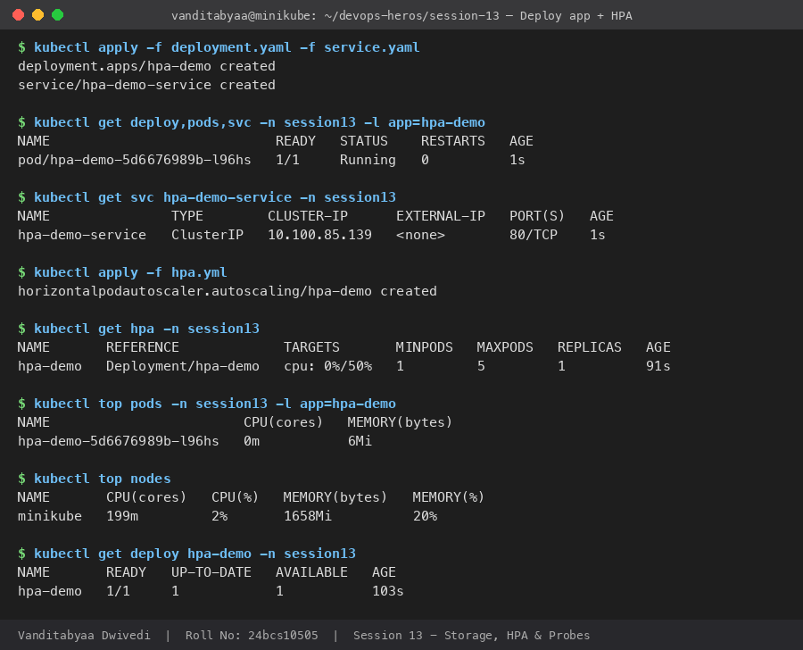
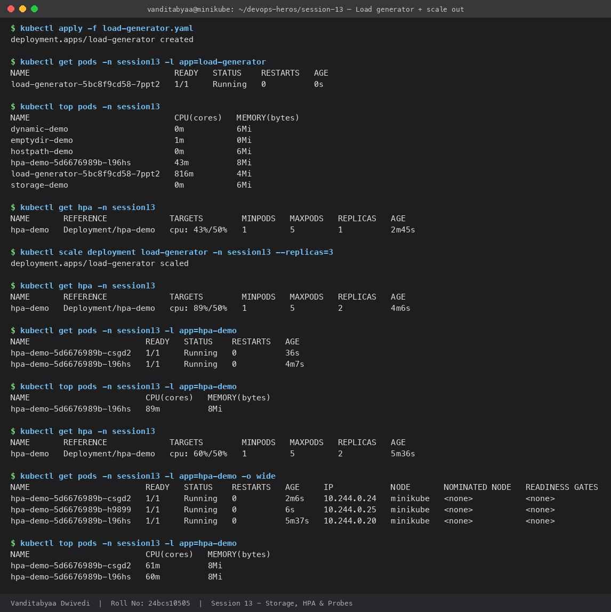
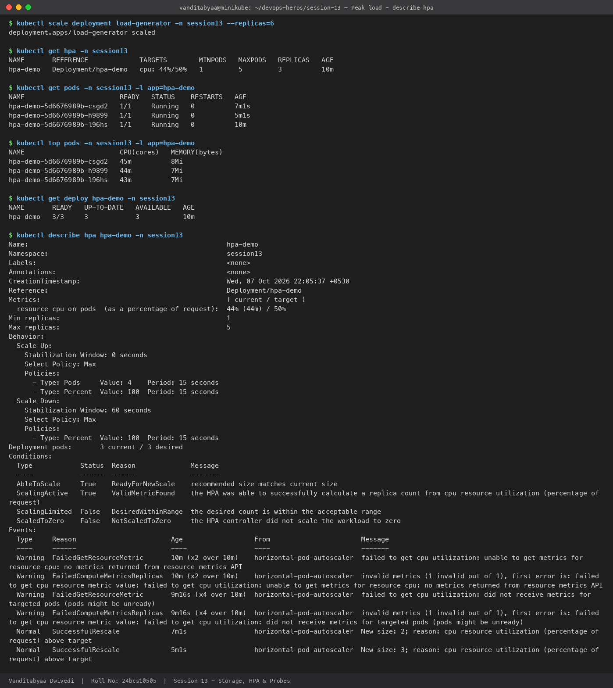
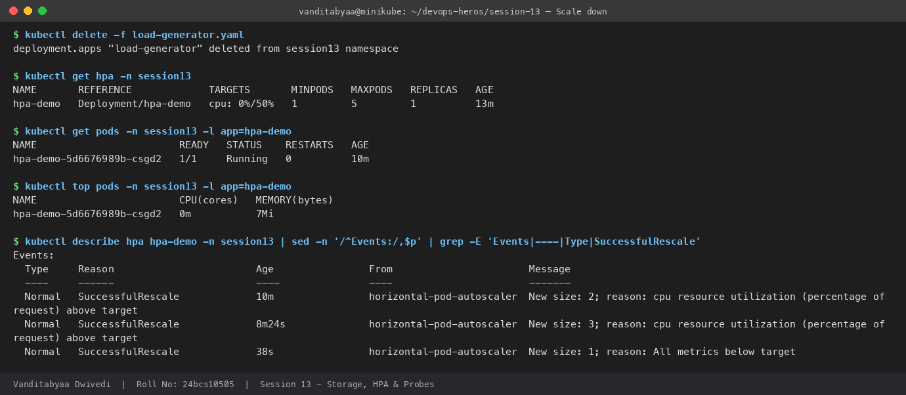
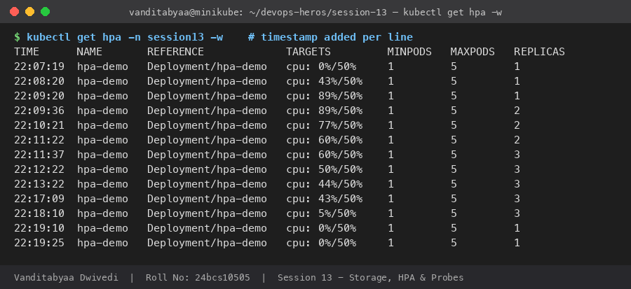

# Task 2: HPA Hands-on (Horizontal Pod Autoscaler)

| | |
|---|---|
| **Name** | Vanditabyaa Dwivedi |
| **Roll No.** | 24bcs10505 |
| **Session** | 13: Kubernetes Storage, HPA & Probes |
| **Cluster** | Minikube (Kubernetes v1.37.0, 8 CPUs), metrics-server addon enabled |

## Files

| File | Purpose |
|---|---|
| [`deployment.yaml`](deployment.yaml) | `hpa-demo` nginx Deployment with **`requests.cpu: 100m`**, which HPA needs to compute utilization |
| [`service.yaml`](service.yaml) | `hpa-demo-service` ClusterIP, which the load generator calls |
| [`hpa.yml`](hpa.yml) | HPA: min 1, max 5 replicas, target **50% average CPU** |
| [`load-generator.yaml`](load-generator.yaml) | busybox Deployment that runs `wget` in a loop against the Service. I used a Deployment so I could **scale the load up** with `kubectl scale`. |
| [`outputs/`](outputs/) | Raw captured terminal output |
| [`screenshots/`](screenshots/) | Screenshots of every step |

Everything runs in the `session13` namespace.

## How HPA works

```text
 load-generator ──wget──▶ hpa-demo-service ──▶ hpa-demo Pods (nginx)
                                                    │ CPU usage
                                                    ▼
                                             metrics-server
                                                    │ every ~15s
                                                    ▼
                                         HPA controller (hpa-demo)
                                                    │ desired = ceil(current × currentCPU% / 50%)
                                                    ▼
                                         Deployment .spec.replicas
```

**Formula:** `desiredReplicas = ceil( currentReplicas × currentUtilization / targetUtilization )`

For example, 1 replica at 89% CPU gives `ceil(1 × 89 / 50) = ceil(1.78) = 2` replicas, which is exactly what happened below.

### HPA manifest (`hpa.yml`)

```yaml
apiVersion: autoscaling/v2
kind: HorizontalPodAutoscaler
metadata:
  name: hpa-demo
  namespace: session13
spec:
  scaleTargetRef:
    apiVersion: apps/v1
    kind: Deployment
    name: hpa-demo
  minReplicas: 1
  maxReplicas: 5
  metrics:
    - type: Resource
      resource:
        name: cpu
        target:
          type: Utilization
          averageUtilization: 50
  behavior:
    scaleDown:
      stabilizationWindowSeconds: 60   # default is 300s; shortened to see scale-down in the lab
```

---

## Step 1: Prerequisites

```bash
minikube start
minikube addons enable metrics-server
kubectl create namespace session13
```

## Step 2: Deploy the application

```bash
kubectl apply -f deployment.yaml -f service.yaml
kubectl get deploy,pods,svc -n session13
```

## Step 3: Configure the HPA

```bash
kubectl apply -f hpa.yml
```

## Step 4: Verify the HPA

```text
$ kubectl get hpa -n session13
NAME       REFERENCE             TARGETS       MINPODS   MAXPODS   REPLICAS   AGE
hpa-demo   Deployment/hpa-demo   cpu: 0%/50%   1         5         1          91s

$ kubectl top pods -n session13 -l app=hpa-demo
NAME                        CPU(cores)   MEMORY(bytes)
hpa-demo-5d6676989b-l96hs   0m           6Mi
```

For the first ~60 seconds `TARGETS` showed `<unknown>/50%`, because metrics-server had not collected a sample from the new Pod yet. `kubectl describe hpa` recorded this as `FailedGetResourceMetric` warnings, which went away on their own.



## Step 5: Deploy the load generator

```bash
kubectl apply -f load-generator.yaml
```

With **1 load-generator pod**, CPU rose to **43%**. That is just under the 50% target, so the HPA correctly did **not** scale.

```text
$ kubectl top pods -n session13
NAME                              CPU(cores)   MEMORY(bytes)
hpa-demo-5d6676989b-l96hs         43m          8Mi
load-generator-5bc8f9cd58-7ppt2   816m         4Mi

$ kubectl get hpa -n session13
NAME       REFERENCE             TARGETS        MINPODS   MAXPODS   REPLICAS
hpa-demo   Deployment/hpa-demo   cpu: 43%/50%   1         5         1
```

## Step 6: Increase the load

```bash
kubectl scale deployment load-generator -n session13 --replicas=3
```

## Step 7: Observe CPU utilization and Pod scaling

CPU jumped to **89%**, so the HPA scaled **1 → 2**. With 2 pods the average was still above target (60–77%), so it scaled **2 → 3**:

```text
$ kubectl get hpa -n session13
NAME       REFERENCE             TARGETS        MINPODS   MAXPODS   REPLICAS
hpa-demo   Deployment/hpa-demo   cpu: 89%/50%   1         5         2

$ kubectl get pods -n session13 -l app=hpa-demo -o wide
NAME                        READY   STATUS    RESTARTS   AGE
hpa-demo-5d6676989b-csgd2   1/1     Running   0          2m6s
hpa-demo-5d6676989b-h9899   1/1     Running   0          6s      <- new pod created by HPA
hpa-demo-5d6676989b-l96hs   1/1     Running   0          5m37s

$ kubectl top pods -n session13 -l app=hpa-demo
NAME                        CPU(cores)   MEMORY(bytes)
hpa-demo-5d6676989b-csgd2   61m          8Mi
hpa-demo-5d6676989b-l96hs   60m          8Mi
```



### Peak load and `kubectl describe hpa`

I then raised the load generator to **6 replicas**. The HPA settled at **3 replicas with about 44% average CPU**. With 3 pods the load per pod was already below the 50% target, so `ceil(3 × 44/50) = 3` and no further scaling was needed. The node itself was only at **24% CPU** (`kubectl top nodes`), so the limit was how many requests the load generators could push through, not the cluster. A heavier workload would push the HPA towards `maxReplicas: 5`.

The **Events** section shows each scaling decision and its reason:

```text
$ kubectl describe hpa hpa-demo -n session13
...
Metrics:                                               ( current / target )
  resource cpu on pods  (as a percentage of request):  44% (44m) / 50%
Min replicas:                                          1
Max replicas:                                          5
Behavior:
  Scale Up:
    Stabilization Window: 0 seconds
    Policies:
      - Type: Pods     Value: 4    Period: 15 seconds
      - Type: Percent  Value: 100  Period: 15 seconds
  Scale Down:
    Stabilization Window: 60 seconds
Deployment pods:       3 current / 3 desired
Conditions:
  AbleToScale     True    ReadyForNewScale    recommended size matches current size
  ScalingActive   True    ValidMetricFound    the HPA was able to successfully calculate a replica count ...
  ScalingLimited  False   DesiredWithinRange  the desired count is within the acceptable range
Events:
  Normal   SuccessfulRescale  7m1s  horizontal-pod-autoscaler  New size: 2; reason: cpu resource utilization (percentage of request) above target
  Normal   SuccessfulRescale  5m1s  horizontal-pod-autoscaler  New size: 3; reason: cpu resource utilization (percentage of request) above target
```



## Step 8: Stop the load and observe scale-down

```bash
kubectl delete -f load-generator.yaml
```

```text
$ kubectl get hpa -n session13
NAME       REFERENCE             TARGETS       MINPODS   MAXPODS   REPLICAS
hpa-demo   Deployment/hpa-demo   cpu: 0%/50%   1         5         1

Events:
  Normal   SuccessfulRescale   10m     New size: 2; reason: cpu resource utilization (percentage of request) above target
  Normal   SuccessfulRescale   8m24s   New size: 3; reason: cpu resource utilization (percentage of request) above target
  Normal   SuccessfulRescale   38s     New size: 1; reason: All metrics below target
```



## Full timeline (`kubectl get hpa -w`)

I sampled the HPA every 15 seconds for the whole experiment. Only the rows where something changed are shown here. The full log is in [`outputs/02-hpa-watch.txt`](outputs/02-hpa-watch.txt).

| Time | CPU / target | Replicas | What happened |
|---|---|---|---|
| 22:07:19 | 0% / 50% | 1 | Idle |
| 22:08:20 | 43% / 50% | 1 | 1 load generator, still below target |
| 22:09:20 | 89% / 50% | 1 | Load increased to 3 generators |
| 22:09:36 | 89% / 50% | **2** | **Scale out 1 → 2** |
| 22:11:37 | 60% / 50% | **3** | **Scale out 2 → 3** |
| 22:13:22 | 44% / 50% | 3 | Stable: load spread over 3 pods |
| 22:18:10 | 5% / 50% | 3 | Load stopped, stabilization window running |
| 22:19:10 | 0% / 50% | **1** | **Scale in 3 → 1** (back to `minReplicas`) |



---

## Observations and learnings

1. **CPU `requests` are required.** Utilization % = usage / request. Without `resources.requests.cpu`, the HPA shows `<unknown>` and never scales.
2. **Scaling up is fast.** The default scale-up stabilization is 0s, and the HPA scaled within about 15s of seeing 89%.
3. **Scaling down is slow on purpose.** The stabilization window (default 300s, 60s here) stops the replica count from flapping when traffic briefly dips.
4. **HPA scales on the average across pods.** Once 3 pods brought the average below 50%, it stopped, even though `maxReplicas` was 5.
5. **metrics-server is required.** `kubectl top` and the HPA both read from it. A brand-new pod shows `<unknown>` until its first sample (~60s).

## Useful commands

```bash
kubectl get hpa -n session13
kubectl get hpa -n session13 -w
kubectl get pods -n session13 -w
kubectl top pods -n session13
kubectl top nodes
kubectl describe hpa hpa-demo -n session13
kubectl scale deployment load-generator -n session13 --replicas=3
```

## Cleanup

```bash
kubectl delete -f hpa.yml -f service.yaml -f deployment.yaml -f load-generator.yaml --ignore-not-found
```
