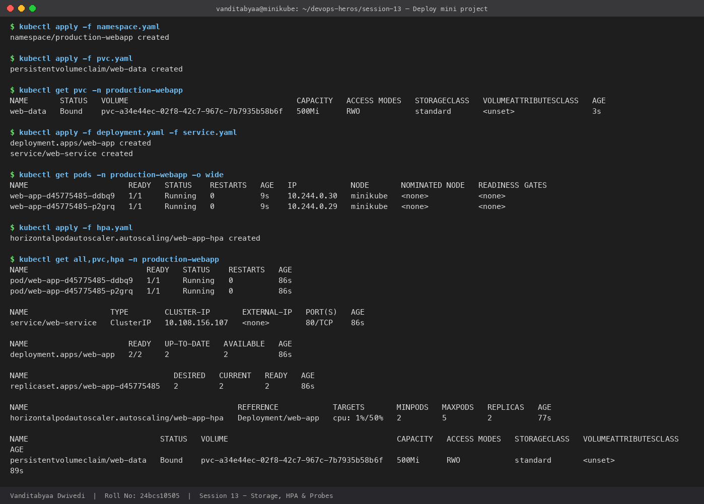
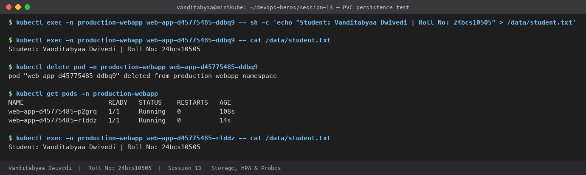
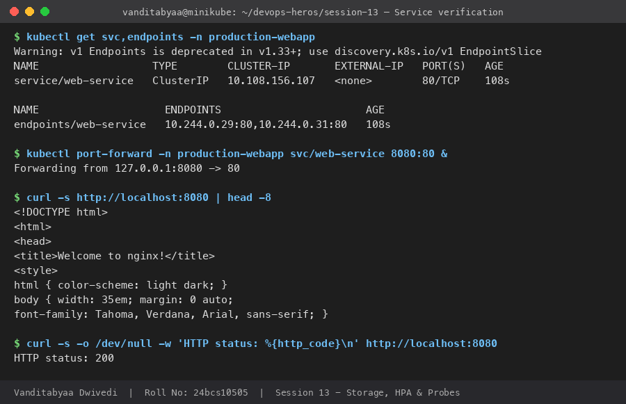
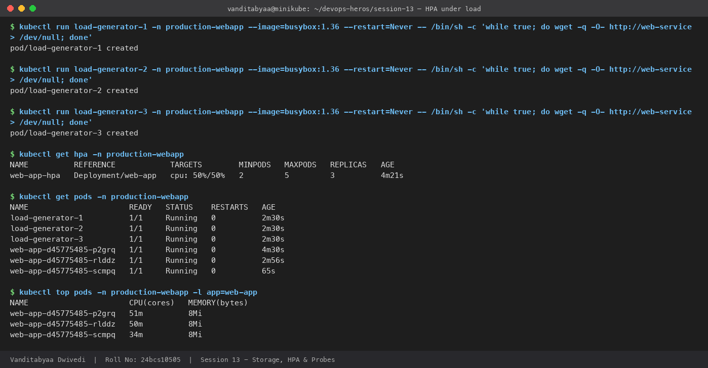
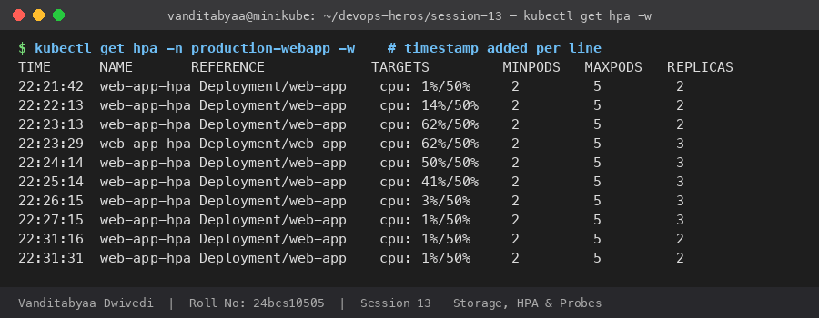
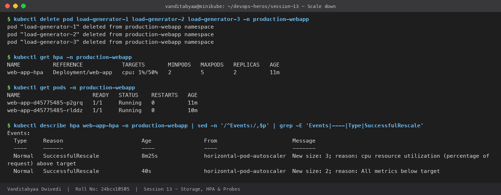
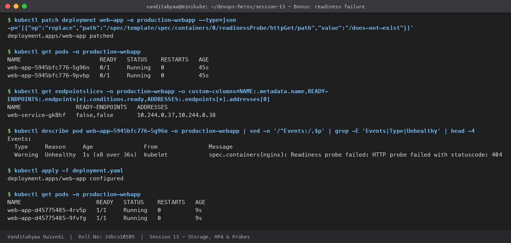
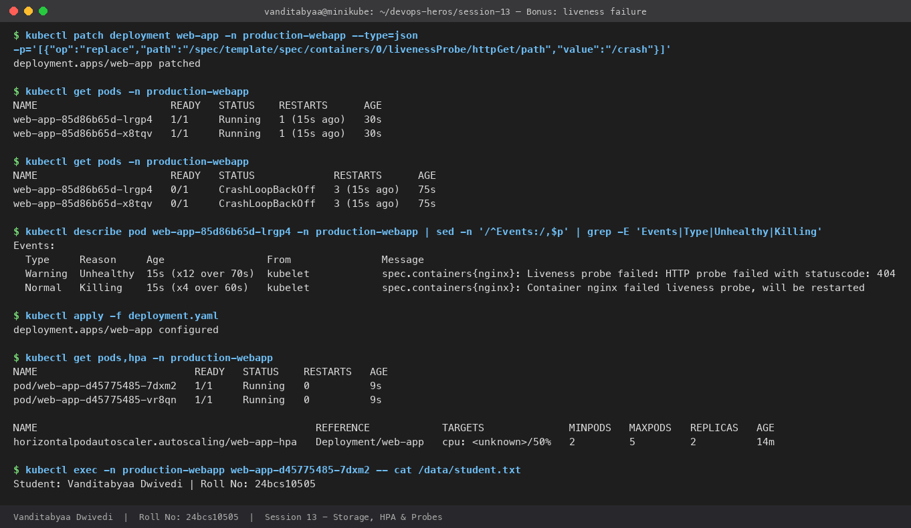

# Task 3: Mini Project: Production-Ready Kubernetes Web App

| | |
|---|---|
| **Name** | Vanditabyaa Dwivedi |
| **Roll No.** | 24bcs10505 |
| **Session** | 13: Kubernetes Storage, HPA & Probes |
| **Cluster** | Minikube (Kubernetes v1.37.0), `metrics-server` and `default-storageclass` addons enabled |

## 1. Overview

This project deploys an nginx web app to its own namespace (`production-webapp`) and combines the three topics from Session 13:

| Pillar | Implementation | Verified by |
|---|---|---|
| **State persistence** | PVC `web-data` (500Mi, RWO, dynamically provisioned by StorageClass `standard`) mounted at `/data` | Wrote a file, deleted the Pod, and read the file back from the new Pod |
| **Elastic scaling** | HPA `web-app-hpa`: 2–5 replicas, target 50% CPU, with `requests.cpu: 100m` on the container | Load test scaled 2 → 3, and it scaled back to 2 when the load stopped |
| **Health checks** | Startup, readiness and liveness HTTP probes on `/` | Bonus: broke each probe on purpose and observed the result |

## 2. Architecture

```text
                          [ Service: web-service (ClusterIP :80) ]
                                           │
                 ┌─────────────────────────┼─────────────────────────┐
                 ▼                         ▼                         ▼
          [ Pod: web-app-1 ]        [ Pod: web-app-2 ]        [ Pod: web-app-N ]
           startup / readiness       startup / readiness       startup / readiness
           / liveness probes         / liveness probes         / liveness probes
           cpu req 100m              cpu req 100m              cpu req 100m
                 │                         │                         │
                 └──────── volumeMount /data ────────────────────────┘
                                           │
                               [ PVC: web-data 500Mi RWO ]
                                           │
                       [ StorageClass: standard (k8s.io/minikube-hostpath) ]
                                           │
                     /tmp/hostpath-provisioner/production-webapp/web-data

      [ Metrics Server ] ──CPU metrics──▶ [ HPA: web-app-hpa (min 2, max 5, 50%) ] ──scales──▶ Deployment web-app
```

## 3. Project structure

```text
03-mini-project/
├── namespace.yaml      # Namespace: production-webapp
├── pvc.yaml            # PVC web-data: 500Mi, ReadWriteOnce
├── deployment.yaml     # web-app: 2 replicas, probes, /data mount, CPU/memory requests & limits
├── service.yaml        # web-service: ClusterIP port 80
├── hpa.yaml            # web-app-hpa: min 2, max 5, 50% CPU
├── outputs/            # raw terminal output captured during the run
├── screenshots/        # screenshots of every step
└── README.md
```

### Key parts of `deployment.yaml`

```yaml
strategy:
  type: Recreate                 # old pods are stopped before new ones start (RWO volume)
resources:
  requests: { cpu: 100m, memory: 64Mi }   # HPA computes utilization against this
  limits:   { cpu: 200m, memory: 128Mi }
volumeMounts:
  - name: persistent-storage
    mountPath: /data
startupProbe:                    # allows up to 30 x 2s = 60s for the app to start
  httpGet: { path: /, port: 80 }
  failureThreshold: 30
  periodSeconds: 2
readinessProbe:                  # 2 failures -> removed from Service endpoints
  httpGet: { path: /, port: 80 }
  periodSeconds: 5
  failureThreshold: 2
livenessProbe:                   # 3 failures -> container restarted
  httpGet: { path: /, port: 80 }
  periodSeconds: 5
  failureThreshold: 3
volumes:
  - name: persistent-storage
    persistentVolumeClaim:
      claimName: web-data
```

---

## 4. Deployment

```bash
kubectl apply -f namespace.yaml
kubectl apply -f pvc.yaml
kubectl apply -f deployment.yaml -f service.yaml
kubectl apply -f hpa.yaml
kubectl get all,pvc,hpa -n production-webapp
```

**Actual output:**

```text
NAME                          READY   STATUS    RESTARTS   AGE
pod/web-app-d45775485-ddbq9   1/1     Running   0          86s
pod/web-app-d45775485-p2grq   1/1     Running   0          86s

NAME                  TYPE        CLUSTER-IP       EXTERNAL-IP   PORT(S)   AGE
service/web-service   ClusterIP   10.108.156.107   <none>        80/TCP    86s

NAME                      READY   UP-TO-DATE   AVAILABLE   AGE
deployment.apps/web-app   2/2     2            2           86s

NAME                                              REFERENCE            TARGETS       MINPODS   MAXPODS   REPLICAS
horizontalpodautoscaler.autoscaling/web-app-hpa   Deployment/web-app   cpu: 1%/50%   2         5         2

NAME                             STATUS   VOLUME                                     CAPACITY   ACCESS MODES   STORAGECLASS
persistentvolumeclaim/web-data   Bound    pvc-a34e44ec-02f8-42c7-967c-7b7935b58b6f   500Mi      RWO            standard
```

The PVC was `Bound` within 3 seconds. I never created a PV by hand: the `standard` StorageClass provisioned `pvc-a34e44ec-...` **dynamically**.



---

## 5. Verification

### Task 1: Storage persistence ✅

```bash
POD_NAME=$(kubectl get pods -n production-webapp -l app=web-app -o jsonpath='{.items[0].metadata.name}')
kubectl exec -n production-webapp "$POD_NAME" -- sh -c 'echo "Student: Vanditabyaa Dwivedi | Roll No: 24bcs10505" > /data/student.txt'
kubectl delete pod -n production-webapp "$POD_NAME"
# the Deployment creates a replacement pod
kubectl exec -n production-webapp <new-pod> -- cat /data/student.txt
```

```text
$ kubectl exec -n production-webapp web-app-d45775485-ddbq9 -- cat /data/student.txt
Student: Vanditabyaa Dwivedi | Roll No: 24bcs10505

$ kubectl delete pod -n production-webapp web-app-d45775485-ddbq9
pod "web-app-d45775485-ddbq9" deleted

$ kubectl get pods -n production-webapp
NAME                      READY   STATUS    RESTARTS   AGE
web-app-d45775485-p2grq   1/1     Running   0          108s
web-app-d45775485-rlddz   1/1     Running   0          14s     <- replacement pod

$ kubectl exec -n production-webapp web-app-d45775485-rlddz -- cat /data/student.txt
Student: Vanditabyaa Dwivedi | Roll No: 24bcs10505
```

**Result:** The Pod was deleted and replaced, and the brand-new Pod still read the same file. The data lives on the PersistentVolume, not inside the container. The file also survived every later rollout, including the probe experiments in section 6.



### Task 2: Service verification ✅

```text
$ kubectl get svc,endpoints -n production-webapp
NAME                  TYPE        CLUSTER-IP       EXTERNAL-IP   PORT(S)
service/web-service   ClusterIP   10.108.156.107   <none>        80/TCP

NAME                    ENDPOINTS
endpoints/web-service   10.244.0.29:80,10.244.0.31:80        <- both pods behind the Service

$ kubectl port-forward -n production-webapp svc/web-service 8080:80 &
$ curl -s http://localhost:8080 | head -4
<!DOCTYPE html>
<html>
<head>
<title>Welcome to nginx!</title>

$ curl -s -o /dev/null -w 'HTTP status: %{http_code}\n' http://localhost:8080
HTTP status: 200
```



### Task 3: HPA elastic scaling ✅

I started 3 load generators inside the namespace:

```bash
for n in 1 2 3; do
  kubectl run load-generator-$n -n production-webapp --image=busybox:1.36 --restart=Never \
    -- /bin/sh -c 'while true; do wget -q -O- http://web-service > /dev/null; done'
done
```

```text
$ kubectl get hpa -n production-webapp
NAME          REFERENCE            TARGETS        MINPODS   MAXPODS   REPLICAS
web-app-hpa   Deployment/web-app   cpu: 50%/50%   2         5         3

$ kubectl top pods -n production-webapp -l app=web-app
NAME                      CPU(cores)   MEMORY(bytes)
web-app-d45775485-p2grq   51m          8Mi
web-app-d45775485-rlddz   50m          8Mi
web-app-d45775485-scmpq   34m          8Mi      <- added by the HPA
```



**Timeline from `kubectl get hpa -w`** (sampled every 15s; the full log is in [`outputs/05-hpa-watch.txt`](outputs/05-hpa-watch.txt)):

| Time | CPU / target | Replicas | Event |
|---|---|---|---|
| 22:21:42 | 1% / 50% | 2 | Idle at `minReplicas` |
| 22:23:13 | 62% / 50% | 2 | Load generators running, above target |
| 22:23:29 | 62% / 50% | **3** | **Scale out 2 → 3** (`ceil(2 × 62/50) = 3`) |
| 22:24:14 | 50% / 50% | 3 | Load spread across 3 pods, at target, so no more scaling |
| 22:26:15 | 3% / 50% | 3 | Load generators deleted |
| 22:31:16 | 1% / 50% | **2** | **Scale in 3 → 2** after the default **5-minute** stabilization window |



```text
Events:
  Normal   SuccessfulRescale   8m25s   New size: 3; reason: cpu resource utilization (percentage of request) above target
  Normal   SuccessfulRescale   40s     New size: 2; reason: All metrics below target
```



The HPA scaled to 3 rather than the maximum of 5 because 3 pods were enough to bring the average down to the 50% target. HPA adds only as many pods as the formula requires.

---

## 6. Probes

| Probe | Question it answers | On failure | Config used |
|---|---|---|---|
| **Startup** | Has the app finished starting? | Container is restarted. Readiness and liveness checks are paused until it passes. | `/` every 2s, 30 failures allowed (≈60s) |
| **Readiness** | Can this pod receive traffic right now? | Pod is **removed from Service endpoints**. **No restart.** | `/` every 5s, 2 failures |
| **Liveness** | Is the container still healthy? | Kubelet **restarts the container** | `/` every 5s, 3 failures |

### Bonus Challenge 2: Readiness failure (readiness path set to `/does-not-exist`)

```bash
kubectl patch deployment web-app -n production-webapp --type=json \
  -p='[{"op":"replace","path":"/spec/template/spec/containers/0/readinessProbe/httpGet/path","value":"/does-not-exist"}]'
```

```text
$ kubectl get pods -n production-webapp
NAME                       READY   STATUS    RESTARTS   AGE
web-app-5945bfc776-5g96n   0/1     Running   0          45s     <- Running but NOT Ready
web-app-5945bfc776-9pvbp   0/1     Running   0          45s

$ kubectl get endpointslices -n production-webapp
NAME                READY-ENDPOINTS   ADDRESSES
web-service-gk8hf   false,false       10.244.0.37,10.244.0.38   <- no ready endpoints, so the Service sends no traffic

Events:
  Warning  Unhealthy  1s (x8 over 36s)  kubelet  Readiness probe failed: HTTP probe failed with statuscode: 404
```

**Learning:** A failing readiness probe **does not restart** the pod (`RESTARTS` stays 0). It only removes the pod from load balancing. Because the Deployment uses `strategy: Recreate`, both old pods were stopped before the broken ones started, so the Service had **zero ready endpoints, which is a full outage**. The default `RollingUpdate` strategy would have kept the old, healthy pods serving until the new ones became Ready.



### Bonus Challenge 3: Liveness failure (liveness path set to `/crash`)

```text
$ kubectl get pods -n production-webapp            # after 30s
NAME                      READY   STATUS    RESTARTS      AGE
web-app-85d86b65d-lrgp4   1/1     Running   1 (15s ago)   30s

$ kubectl get pods -n production-webapp            # after 75s
NAME                      READY   STATUS             RESTARTS      AGE
web-app-85d86b65d-lrgp4   0/1     CrashLoopBackOff   3 (15s ago)   75s

Events:
  Warning  Unhealthy  15s (x12 over 70s)  kubelet  Liveness probe failed: HTTP probe failed with statuscode: 404
  Normal   Killing    15s (x4 over 60s)   kubelet  Container nginx failed liveness probe, will be restarted
```

**Learning:** A failing liveness probe makes the kubelet **kill and restart** the container about every 15s (`periodSeconds: 5 × failureThreshold: 3`). After repeated restarts the pod goes into **CrashLoopBackOff**, with a growing delay between restarts. The startup probe (path `/`) still passed, which is why the liveness probe ran at all.

After each challenge I restored the original configuration with `kubectl apply -f deployment.yaml`. Both pods returned to `1/1 Running`, and `/data/student.txt` was still present, so the PVC survived all of these rollouts.



---

## 7. Troubleshooting guide

| Symptom | Check | Root cause | Fix |
|---|---|---|---|
| PVC stuck in `Pending` | `kubectl describe pvc web-data -n production-webapp` | No default StorageClass, or the provisioner isn't running | `minikube addons enable default-storageclass`, then `kubectl get sc` |
| HPA `TARGETS: <unknown>/50%` | `kubectl top pods -n production-webapp` | metrics-server is off, the pod is too new (no sample yet), or `requests.cpu` is missing | `minikube addons enable metrics-server`, wait about 60s, and set `cpu: 100m` |
| Pods `0/1 Running`, Service returns nothing | `kubectl get endpointslices`, then the pod's Events | Readiness probe failing (wrong path or port) | Fix `readinessProbe.httpGet.path` so it returns HTTP 200–399 |
| `CrashLoopBackOff`, restarts increasing | `kubectl describe pod`, look for `Killing ... failed liveness probe` | Liveness probe failing | Fix the liveness path or port, or increase `initialDelaySeconds` / use a startup probe |
| New pods stuck `ContainerCreating` when scaling across nodes | `kubectl describe pod`, look for `Multi-Attach error` | RWO volume can only be attached to **one node** | Use RWX storage (NFS / EFS) or a StatefulSet with one PVC per pod |

## 8. Production notes

- **RWO + multiple replicas:** This works on single-node Minikube because every replica runs on the same node. On a multi-node cluster, replicas on other nodes could not mount `web-data`. Real apps would use RWX storage, object storage, or a **StatefulSet** with `volumeClaimTemplates`.
- **`Recreate` vs `RollingUpdate`:** `Recreate` avoids two pods fighting over an RWO volume during an update, but it causes downtime, as Bonus Challenge 2 showed.
- **Probes on the same path:** Using `/` for all three probes is fine for nginx. Real apps should have a lightweight `/healthz` for liveness and a `/ready` endpoint that checks dependencies, for example the database, for readiness.

## 9. Cleanup

```bash
kubectl delete namespace production-webapp   # also deletes the PVC; the dynamic PV is deleted (reclaimPolicy: Delete)
```
