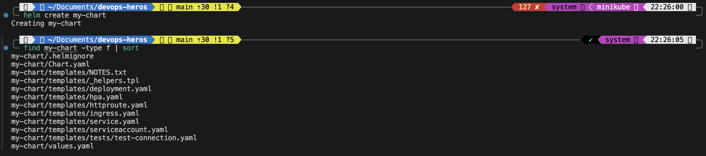

# Session 15: Helm

Helm is the package manager for Kubernetes.

- **Chart:** a package of Kubernetes templates. Think of it as the recipe.
- **Values:** the settings that fill the templates. Think of them as the ingredients.
- **Release:** one installed copy of a chart in the cluster. Think of it as the cooked meal.
- **Revision:** a numbered version of a release. Every install, upgrade and rollback creates a new one.

## Folder Structure

```
session-15-helm/
├── 01-helm-commands/
│   └── my-chart/            # Generated with helm create in Task 1
├── 02-rollback/
│   └── app-chart/           # Chart used for the rollback workflow
│       ├── Chart.yaml
│       ├── values.yaml
│       └── templates/deployment.yaml
├── 03-mini-project/
│   └── notes-chart/         # Notes App chart
│       ├── Chart.yaml
│       ├── values.yaml
│       ├── values-prod.yaml
│       └── templates/
│           ├── configmap.yaml
│           ├── deployment.yaml
│           └── service.yaml
├── screenshots/
└── README.md
```

Run every command from inside this folder, with minikube running.

---

## Task 1: Helm Commands

| Command | What it does | Shown in |
|---|---|---|
| `helm create` | Generates a new chart skeleton | 1.1 |
| `helm lint` | Checks a chart for errors | 1.2 |
| `helm template` | Renders templates locally without installing | 1.2 |
| `helm install` | Installs a chart as a new release | 1.3 |
| `helm list` | Lists releases in the namespace | 1.3 |
| `helm status` | Shows the state of one release | 1.4 |
| `helm get` | Shows the values, manifest or notes of a release | 1.4 |
| `helm upgrade` | Applies a new chart version or new values to a release | Task 2 |
| `helm history` | Lists all revisions of a release | Task 2 |
| `helm rollback` | Returns a release to an earlier revision | Task 2 |
| `helm uninstall` | Deletes a release and its resources | 1.5 |
| `helm repo` | Adds, lists and updates chart repositories | 1.6 |
| `helm search` | Finds charts in added repos or on Artifact Hub | 1.7 |

### 1.1 helm create

```bash
cd 01-helm-commands
helm version
helm create my-chart
find my-chart -type f | sort
```



**Observation:** `helm create` builds a working nginx chart with `Chart.yaml`, `values.yaml` and templates for a Deployment, Service, ServiceAccount, Ingress, HPA and a test.

### 1.2 helm lint and helm template

```bash
helm lint my-chart
helm template my-release my-chart | head -40
```


**Observation:** `helm template` shows the final YAML that Helm would send to Kubernetes, with `.Release.Name` replaced by `my-release`. Nothing is created in the cluster.

### 1.3 helm install and helm list

```bash
helm install my-release ./my-chart
helm list
kubectl get pods,svc
```


### 1.4 helm status and helm get

```bash
helm status my-release
helm get values my-release --all | head -20
helm get manifest my-release | head -40
```


**Observation:** `helm status` shows the revision and state. `helm get values --all` shows every value in use. `helm get manifest` shows the exact YAML that was applied.

### 1.5 helm uninstall

```bash
helm uninstall my-release
helm list
kubectl get pods
```


### 1.6 helm repo

```bash
helm repo add bitnami https://charts.bitnami.com/bitnami
helm repo list
helm repo update
```


### 1.7 helm search

```bash
helm search repo nginx
helm search hub nginx | head -10
helm show chart bitnami/nginx
```


**Observation:** `helm search repo` looks only in repos added with `helm repo add`. `helm search hub` searches the public Artifact Hub.

```bash
cd ..
```

---

## Task 2: Helm Rollback Workflow

The flow is Install, Upgrade, Verify, Upgrade again, Verify, Rollback, Verify.

`app-chart` deploys `{{ .Release.Name }}-app` with `replicaCount: 1` and image `nginx:1.24`.

### 2.1 Install (revision 1)

```bash
helm install web-app ./02-rollback/app-chart
helm list
kubectl get deploy web-app-app -o wide
```


### 2.2 Upgrade and verify (revision 2)

```bash
helm upgrade web-app ./02-rollback/app-chart --set replicaCount=3
kubectl rollout status deploy/web-app-app
kubectl get deploy web-app-app -o wide
kubectl get pods
```


### 2.3 Upgrade again with a bad image and verify (revision 3)

`--reuse-values` keeps the 3 replicas from revision 2 and only changes the image tag.

```bash
helm upgrade web-app ./02-rollback/app-chart --reuse-values --set image.tag=doesnotexist
```

Wait about 20 seconds.

```bash
kubectl get pods
helm status web-app
```


**Observation:** Helm reports the upgrade as `deployed` because it only applies the YAML. The new Pod fails with `ErrImagePull` or `ImagePullBackOff`. The rolling update keeps the 3 old Pods running, so the app stays up.

### 2.4 Rollback and verify (revision 4)

```bash
helm history web-app
```


```bash
helm rollback web-app 2
kubectl rollout status deploy/web-app-app
helm history web-app
kubectl get deploy web-app-app -o wide
kubectl get pods
```


**Observation:** Rollback does not delete history. It creates revision 4 with the same settings as revision 2: 3 replicas of `nginx:1.24`. The broken Pod is gone.

### 2.5 Cleanup

```bash
helm uninstall web-app
helm list
```


---

## Task 3: Mini Project — Package and Deploy the Notes App with Helm

The Notes App is an nginx Deployment with a ConfigMap and a NodePort Service, packaged as `notes-chart`.

| Key | values.yaml | values-prod.yaml |
|---|---|---|
| replicaCount | 1 | 3 |
| image.tag | 1.24 | 1.25 |
| service.nodePort | 30090 | 30090 |
| app.environment | development | production |

The ConfigMap `{{ .Release.Name }}-config` holds `APP_NAME` and `ENVIRONMENT`. The Deployment loads them as environment variables with `envFrom`.

### 3.1 Lint and render

```bash
helm lint ./03-mini-project/notes-chart
helm template notes-dev ./03-mini-project/notes-chart
```


### 3.2 Install the development release

```bash
helm install notes-dev ./03-mini-project/notes-chart
kubectl get pods
kubectl get services
kubectl get configmaps
```


### 3.3 Verify the config and access the app

```bash
kubectl exec deploy/notes-dev-deploy -- env | grep -E "APP_NAME|ENVIRONMENT"
kubectl port-forward svc/notes-dev-svc 8080:80
```

In a second terminal:

```bash
curl -s http://localhost:8080 | head -5
```


Stop the port-forward with `Ctrl+C`.

### 3.4 Upgrade to production values (revision 2)

```bash
helm upgrade notes-dev ./03-mini-project/notes-chart -f ./03-mini-project/notes-chart/values-prod.yaml
kubectl rollout status deploy/notes-dev-deploy
kubectl get pods
kubectl exec deploy/notes-dev-deploy -- env | grep ENVIRONMENT
```


### 3.5 History and values

```bash
helm history notes-dev
helm get values notes-dev
helm get values notes-dev --revision 1
```


### 3.6 Simulate a bad upgrade (revision 3)

```bash
helm upgrade notes-dev ./03-mini-project/notes-chart \
  -f ./03-mini-project/notes-chart/values-prod.yaml \
  --set image.tag=broken-tag-does-not-exist
```

Wait about 20 seconds.

```bash
kubectl get pods
```


### 3.7 Roll back to revision 2

```bash
helm rollback notes-dev 2
kubectl rollout status deploy/notes-dev-deploy
helm history notes-dev
kubectl get pods
```


### 3.8 Uninstall

```bash
helm uninstall notes-dev
helm list
kubectl get pods,svc,configmaps
```


### What I practiced

- Created a chart and rendered it locally before installing.
- Used `values.yaml` for development and `values-prod.yaml` for production.
- Installed a release and upgraded it with different values.
- Simulated a bad upgrade and rolled back to a known good revision.
- Inspected releases with `status`, `get` and `history`, then uninstalled.

---

## Key Learnings

- `helm template` and `helm lint` catch mistakes before anything reaches the cluster.
- Values precedence is `values.yaml`, then `-f` files, then `--set`, with the last one winning.
- `helm upgrade` without `-f` or `--reuse-values` falls back to the chart defaults.
- Helm marks a release `deployed` once the YAML is applied, even if Pods later fail. Always check the Pods.
- Every change, including a rollback, adds a new revision, so the full history is kept.
- `helm upgrade --install` installs or upgrades in one command and is the usual choice in CI/CD.
