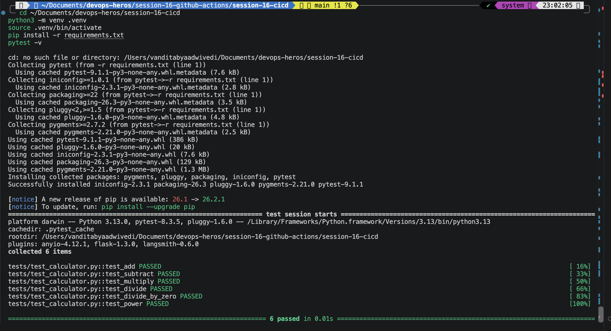

# Session 16: CI/CD & GitHub Actions

**Name:** <your name>  
**Roll Number:** <your roll number>

A calculator app with a complete GitHub Actions pipeline that tests, builds, checks and delivers it as a Docker image.

## Folder Structure

```
devops-heros/                             <- repository root
├── .github/workflows/
│   └── session-16-ci-cd.yml              # The pipeline (must live at the repo root)
└── session-16-cicd/
    ├── app/calculator.py                 # Application source code
    ├── tests/test_calculator.py          # 6 pytest tests
    ├── build.sh                          # Build script
    ├── Dockerfile                        # Image used by the CD job
    ├── requirements.txt
    ├── screenshots/
    └── README.md
```

GitHub only reads workflows from `.github/workflows/` at the repo root. Because this project sits in a subfolder, the workflow limits itself with a `paths` filter and sets `defaults.run.working-directory: session-16-cicd`.

---

## Concepts

### CI vs CD

| | Continuous Integration | Continuous Delivery | Continuous Deployment |
|---|---|---|---|
| Goal | Merge code often and catch problems early | Always have a releasable build | Release automatically |
| Does | Build, test, check | Package and publish an artifact or image | Push straight to production |
| Human approval | Not needed | Before release | None |
| In this project | `test`, `build`, `security-check` | `deliver` publishes an image | Not used |

### GitHub Actions terms

| Term | Meaning | In this project |
|---|---|---|
| Workflow | A YAML file that defines an automated process | `session-16-ci-cd.yml` |
| Event | What starts the workflow | `push`, `pull_request`, `workflow_dispatch` |
| Job | A group of steps that runs on one runner | `test`, `build`, `security-check`, `deliver` |
| Step | One command or reusable action inside a job | `pytest -v`, `actions/checkout` |
| Runner | The machine that runs a job | `ubuntu-latest` (GitHub-hosted) |
| Secret | Encrypted value that is never shown in logs | `DEMO_SECRET`, `GITHUB_TOKEN` |
| Artifact | Files saved from a run so you can download them | `calculator-build` |

### Pipeline flow

```
git push
   │
   ▼
 test ──────────┬──────────────┐
 (pytest)       ▼              ▼
              build       security-check
        (build + artifact)  (sensitive files, secret)
                │              │
                └──────┬───────┘
                       ▼
                   deliver
        (Docker image pushed to GHCR, main only)
```

`build` and `security-check` run in parallel after `test`. `deliver` waits for both because of `needs`. If `test` fails, nothing after it runs.

---

## Part 1: Run the project locally

```bash
cd session-16-cicd
python3 -m venv .venv
source .venv/bin/activate
pip install -r requirements.txt
pytest -v
```



```bash
chmod +x build.sh
./build.sh
cat build/build-info.txt
```


```bash
python app/calculator.py
```

Type `10 + 5`, then `2 * 8`, then `q`.


---

## Part 2: Build and run the Docker image

```bash
docker build -t session16-calculator .
docker run -it --rm session16-calculator
```

Type `7 - 2`, then `q`.

```bash
docker images session16-calculator
```


---

## Part 3: Add the secret

The pipeline reads a secret named `DEMO_SECRET`. The value here is a fake classroom value.

```bash
gh secret set DEMO_SECRET --body "hello-github-actions"
gh secret list
```

Or in the browser: repository **Settings > Secrets and variables > Actions > New repository secret**.


**Observation:** Once saved, the value can never be viewed again. Only its name and update date are shown.

---

## Part 4: Push and watch the pipeline

Run these from the repository root.

```bash
git add .github session-16-cicd
git commit -m "Add Session 16 CI/CD pipeline"
git push
gh run watch
```

Or open the repository on GitHub and go to the **Actions** tab.


### 4.1 Pipeline graph

Open the run. All four jobs should be green.


### 4.2 Job logs

Open the **Test Application** job and expand **Run tests**.


Open **Security Check** and expand **Check demo secret is available**.


**Observation:** The log says the secret is configured but never prints its value. GitHub also masks it as `***` if it ever appears.

### 4.3 Artifact

At the bottom of the run summary there is an **Artifacts** section.

```bash
gh run list --limit 3
gh run download --name calculator-build --dir downloaded-build
ls downloaded-build
cat downloaded-build/build-info.txt
```


Delete the download afterwards with `rm -r downloaded-build`.

### 4.4 Delivered image (CD)

On the repository home page, open **Packages** on the right side, or go to your profile's Packages tab.

```bash
docker pull ghcr.io/vanditabyaa09/devops-heros/session16-calculator:latest
docker run -it --rm ghcr.io/vanditabyaa09/devops-heros/session16-calculator:latest
```

If the pull is denied, open the package settings and change its visibility to public.


---

## Part 5: Make the pipeline fail on purpose

Break a test by editing `app/calculator.py` so `add` returns the wrong value.

```bash
sed -i '' 's/return a + b$/return a + b + 1/' session-16-cicd/app/calculator.py
git diff
git add -A session-16-cicd
git commit -m "Break add on purpose to see CI fail"
git push
gh run watch
```


Open the failed **Test Application** job to see why.

```bash
gh run view "$(gh run list --limit 1 --json databaseId --jq '.[0].databaseId')" --log-failed | head -30
```


**Observation:** `test` failed, so the jobs that depend on it were skipped and no image was delivered. This is the main value of CI: broken code never reaches the next stage.

Now fix it.

```bash
git revert --no-edit HEAD
git push
gh run watch
```


---

## Part 6: Student tasks from the session

| Task | Done in this project |
|---|---|
| Add `def power(a, b): return a ** b` | In `app/calculator.py` |
| Add `def test_power(): assert power(2, 3) == 8` | In `tests/test_calculator.py` |
| Run `pytest`, expect all tests to pass | 6 passed (Part 1) |
| Push to GitHub | Part 4 |
| Check Actions for green Test and Build jobs | Part 4.1 |
| Download `calculator-build` and inspect it | Part 4.3 |

---

## Key Learnings

- **CI** builds and tests every change automatically. **CD** takes a good build and delivers it.
- **Jobs** run in parallel unless `needs` makes them wait. A failed job skips everything that depends on it.
- **Steps** are either shell commands (`run`) or reusable actions (`uses`).
- **Runners** are fresh machines for every job, so each job must check out the code itself.
- **Secrets** are encrypted, hidden in logs and never committed to Git.
- **Artifacts** keep files from a run, such as build output, so they can be downloaded later.
- `GITHUB_TOKEN` is created automatically for every run, so publishing to GHCR needs no extra setup. The `packages: write` permission is what allows the push.
- Workflows must live in `.github/workflows/` at the repo root, even when the project sits in a subfolder.
