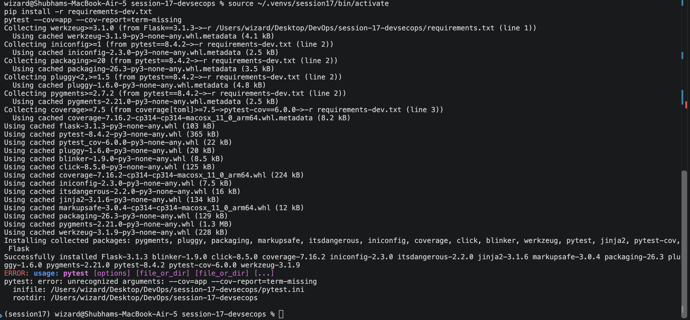

# Session 17: Complete CI/CD & DevSecOps

**Name:** Shubham Shah  
**Roll Number:** 10316

A Flask web app with a CI/CD pipeline that scans the code, the dependencies, the secrets and the Docker image before anything is published or deployed.

## Folder Structure

```
DevOps/                                   <- repository root
├── .github/workflows/
│   └── session-17-devsecops.yml          # The pipeline (must live at the repo root)
└── session-17-devsecops/
    ├── app/                              # Flask application (app.py, templates, static)
    ├── tests/test_app.py                 # 8 pytest tests
    ├── k8s/
    │   ├── deployment.yaml               # 2 replicas, probes, non-root, resource limits
    │   └── service.yaml                  # NodePort service
    ├── Dockerfile                        # Non-root image
    ├── requirements.txt
    ├── requirements-dev.txt
    ├── pytest.ini
    ├── screenshots/
    └── README.md
```

GitHub only reads workflows from `.github/workflows/` at the repo root. The workflow uses a `paths` filter and `defaults.run.working-directory` to work with this subfolder.

---

## Concepts

DevSecOps means security checks run automatically inside the pipeline, at every change. Finding a problem early, before it ships, is called "shifting left".

| Check | What it looks at | Tool | Fails the build when |
|---|---|---|---|
| Unit tests | Does our code behave correctly | pytest | A test fails |
| SAST | Our own source code, without running it | Bandit and CodeQL | Bandit finds a medium or high issue |
| SCA | Third-party packages we depend on | pip-audit | A dependency has a known vulnerability |
| Secret scanning | Passwords, keys and tokens committed in files | Gitleaks | A secret is found |
| Image scanning | The built Docker image and its OS packages | Trivy | A HIGH or CRITICAL fixable vulnerability is found |
| Security gate | All of the above together | `needs` in the workflow | Any required check is not green |

### Pipeline flow

```
Code push
   │
   ▼
┌──────────────┬──────────────┬──────────────┬──────────────┐
│ Build + Unit │     SAST     │     SCA      │ Secret Scan  │   run in parallel
│    Test      │ Bandit/CodeQL│  pip-audit   │   Gitleaks   │
└──────┬───────┴──────┬───────┴──────┬───────┴──────┬───────┘
       └──────────────┴──────┬───────┴──────────────┘
                             ▼
                       Docker Build          (built ONCE, saved as an artifact)
                             ▼
                  Container Image Scan       (Trivy scans that exact image)
                             ▼
                       Security Gate         (all checks must be green)
                             ▼
                  Push Image to GHCR         (main branch only)
                             ▼
                   Deploy to Kubernetes      (kind cluster, rollout + smoke test)
```

### Design choices

- **The image is built once.** The same file that Trivy scans is the one that is pushed and deployed, so the scanned image and the shipped image are always identical.
- **Every scanner can block.** Bandit uses `-ll`, pip-audit and Gitleaks exit non-zero on findings, and Trivy uses `exit-code: "1"`.
- **The registry is GHCR.** It logs in with the built-in `GITHUB_TOKEN`, so no extra secret is needed.
- **Push and deploy run only on `main`.** Pull requests run every check but never publish.
- **Kubernetes runs in a temporary kind cluster** inside the runner, because a GitHub runner cannot reach a cluster on a laptop. A real cluster would pull the image from GHCR.
- **CodeQL reports but does not block by itself.** Its findings appear under Security > Code scanning. Blocking on them needs a branch protection rule. Bandit is the SAST check that fails the job directly.

---

## Part 1: Run the app and the tests locally

```bash
cd session-17-devsecops
python3 -m venv ~/.venvs/session17
source ~/.venvs/session17/bin/activate
pip install -r requirements-dev.txt
pytest --cov=app --cov-report=term-missing
```



```bash
python app/app.py
```

In a second terminal:

```bash
curl http://localhost:5001/health
curl http://localhost:5001/api/status
curl -X POST http://localhost:5001/api/add -H "Content-Type: application/json" -d '{"number1": 10, "number2": 20}'
```

Open http://localhost:5001 in a browser too. Stop the app with `Ctrl+C`.

The virtual environment lives outside the project on purpose, so the local secret scan in Part 2 does not read thousands of library files.


---

## Part 2: Run each security check locally

Running the scanners on your own machine first shows what the pipeline will see.

### 2.1 SAST with Bandit

```bash
pip install bandit
bandit -r app -ll
```


### 2.2 SCA with pip-audit

```bash
pip install pip-audit
pip-audit -r requirements.txt
```


### 2.3 Secret scan with Gitleaks

```bash
docker run --rm -v "$PWD:/scan" zricethezav/gitleaks:latest detect --no-git --source /scan --redact --verbose
```


### 2.4 Build the image and scan it with Trivy

```bash
docker build -t session17-python:local .
docker run --rm session17-python:local id
docker run --rm -v /var/run/docker.sock:/var/run/docker.sock aquasec/trivy:latest image \
  --severity HIGH,CRITICAL --ignore-unfixed session17-python:local
```


**Observation:** The container runs as `appuser` (uid 10001), not root. Trivy finds no fixable HIGH or CRITICAL vulnerabilities.

---

## Part 3: Test the Kubernetes manifests locally

The manifests contain a placeholder `__IMAGE__`. The pipeline fills it in. Here we use the local image on minikube in a temporary namespace.

```bash
minikube image load session17-python:local
kubectl create namespace s17-demo
sed "s|__IMAGE__|session17-python:local|" k8s/deployment.yaml | kubectl apply -n s17-demo -f -
kubectl apply -n s17-demo -f k8s/service.yaml
kubectl rollout status deployment/session17-python -n s17-demo
kubectl get pods,svc -n s17-demo
```


```bash
kubectl port-forward -n s17-demo svc/session17-python 5051:80
```

In a second terminal:

```bash
curl http://localhost:5051/health
```


Stop the port-forward with `Ctrl+C`, then clean up.

```bash
kubectl delete namespace s17-demo
```

---

## Part 4: Push the pipeline and watch it run

Run these from the repository root.

```bash
cd ..
git add .github session-17-devsecops
git commit -m "Add Session 17 DevSecOps pipeline"
git push
gh run watch
```

Or open the **Actions** tab on GitHub. `gh run view` needs a run ID when its output is piped, so the commands below look up the latest run first.


### 4.1 Pipeline graph

All nine jobs should be green, in this order: the four checks, then Docker Build, Image Scan, Security Gate, Push and Deploy.


### 4.2 Individual checks

Open each job and expand its main step.


### 4.3 CodeQL results

Go to the repository **Security** tab, then **Code scanning**.


### 4.4 Published image and deployment

```bash
gh run view "$(gh run list --limit 1 --json databaseId --jq '.[0].databaseId')" --log | grep -A12 "Smoke test"
```

On the repository home page, open **Packages** to see the image tagged with the commit SHA.


---

## Part 5: Prove the security gates really block

Before you start, commit and push everything on `main` (your screenshots and README edits). Each demo adds only the one file it names, so nothing else leaks into the demo branch.

Each demo uses its own branch and pull request, so `main` stays clean. A pull request runs every check but never pushes or deploys. After each demo, close the pull request and go back to `main`.

### 5.1 Secret scan blocks a leaked key

```bash
git switch -c demo/secret-leak
printf 'API_KEY = "%s"\n' "$(openssl rand -base64 36 | tr -d '/+=\n' | cut -c1-32)" > session-17-devsecops/app/leaked_config.py
git add session-17-devsecops/app/leaked_config.py
git commit -m "Demo: commit a fake API key"
git push -u origin demo/secret-leak
gh pr create --fill --base main
sleep 15
gh pr checks --watch
```


```bash
gh run view "$(gh run list --branch demo/secret-leak --limit 1 --json databaseId --jq '.[0].databaseId')" --log-failed | grep -iE "leak|RuleID|File"
gh pr close demo/secret-leak --delete-branch
git switch main
```


**Observation:** The key is a random fake value generated on the spot. It is created at run time because writing a key-like string in this README would make the secret scan flag the README itself. The secret scan went red and every job after it was skipped. Nothing was built or published.

### 5.2 SCA blocks a vulnerable dependency

```bash
git switch -c demo/vulnerable-dependency
sed -i '' 's/^Flask==.*/Flask==2.2.4/' session-17-devsecops/requirements.txt
git add session-17-devsecops/requirements.txt
git commit -m "Demo: pin an old vulnerable Flask"
git push -u origin demo/vulnerable-dependency
gh pr create --fill --base main
sleep 15
gh pr checks --watch
```


```bash
gh run view "$(gh run list --branch demo/vulnerable-dependency --limit 1 --json databaseId --jq '.[0].databaseId')" --log-failed | grep -E "flask|PYSEC"
gh pr close demo/vulnerable-dependency --delete-branch
git switch main
```


**Observation:** pip-audit reports known vulnerabilities in Flask 2.2.4 and names the fixed versions. The unit test job may also fail because the old Flask is not compatible with the newer Werkzeug. The SCA failure is the one this demo shows.

### 5.3 SAST blocks unsafe code

```bash
git switch -c demo/unsafe-code
printf 'def run(expression):\n    return eval(expression)\n' > session-17-devsecops/app/unsafe.py
git add session-17-devsecops/app/unsafe.py
git commit -m "Demo: add unsafe eval"
git push -u origin demo/unsafe-code
gh pr create --fill --base main
sleep 15
gh pr checks --watch
```


```bash
gh run view "$(gh run list --branch demo/unsafe-code --limit 1 --json databaseId --jq '.[0].databaseId')" --log-failed | grep -E "B307|Severity|Location"
gh pr close demo/unsafe-code --delete-branch
git switch main
```


**Observation:** Bandit flags `eval()` as a medium severity issue (B307), so the SAST job fails.

### 5.4 Image scan blocks a vulnerable base image

```bash
git switch -c demo/old-base-image
sed -i '' 's/^FROM python:3.12-slim/FROM python:3.9-slim/' session-17-devsecops/Dockerfile
git add session-17-devsecops/Dockerfile
git commit -m "Demo: use an old base image"
git push -u origin demo/old-base-image
gh pr create --fill --base main
sleep 15
gh pr checks --watch
```


```bash
gh run view "$(gh run list --branch demo/old-base-image --limit 1 --json databaseId --jq '.[0].databaseId')" --log-failed | grep -E "Total|HIGH|CRITICAL" | head -10
gh pr close demo/old-base-image --delete-branch
git switch main
```


**Observation:** The code was fine, but the old Debian packages in the base image have many HIGH and CRITICAL vulnerabilities. Trivy failed, so the Security Gate stayed closed and no image was pushed.

---

## Key Learnings

- **SAST** reads our source, **SCA** checks the libraries we use, **secret scanning** looks for leaked credentials, and **image scanning** checks the final container. Each finds a different kind of problem.
- A **security gate** is simply `needs` plus scanners that exit non-zero. If any check is red, the jobs after it are skipped.
- **Build once, scan that image, push that image.** Rebuilding between steps means the scanned image is not the shipped image.
- Scanners must be able to **fail** the build. A scan that only prints results does not protect anything.
- **`--ignore-unfixed`** hides vulnerabilities that have no fix yet, so the gate fails only on problems we can actually act on.
- Running as a **non-root user**, setting **resource limits** and adding **health probes** makes the Kubernetes deployment safer.
- Never commit real secrets. If one is committed, rotate it, because removing the file does not remove it from Git history.
