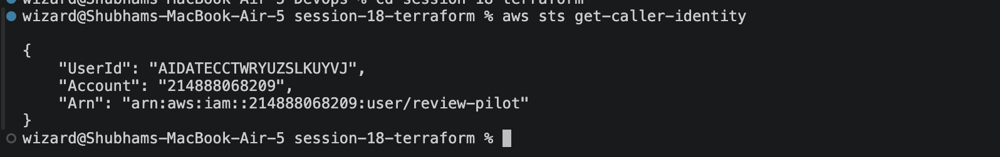

# Terraform S3 Demo

**Name:** Shubham Shah  
**Roll Number:** 10316

Creates an AWS S3 bucket with Terraform and walks through the full workflow: `init`, `fmt`, `validate`, `plan`, `apply`, `show`, `output` and `destroy`.

## Project Structure

```
terraform-s3-demo/
├── provider.tf        # Terraform and AWS provider versions, region
├── variables.tf       # Input variables
├── main.tf            # The S3 bucket and its public access block
├── outputs.tf         # Values printed after apply
├── terraform.tfvars   # Values for the variables
├── .gitignore         # Keeps state and .terraform/ out of Git
├── screenshots/
└── README.md
```

| File | Purpose |
|---|---|
| `provider.tf` | Pins Terraform to 1.6 or newer and the AWS provider to 6.x. Sets the region from a variable. No credentials are written here. |
| `variables.tf` | Declares `aws_region`, `bucket_name` and `environment`. |
| `main.tf` | Defines `aws_s3_bucket.demo` and `aws_s3_bucket_public_access_block.demo`. |
| `outputs.tf` | Prints the bucket name, ARN and region. |
| `terraform.tfvars` | Sets the real values. Terraform loads this file automatically. |

The public access block is an extra resource. It makes sure the bucket can never be made public by mistake. Its `bucket` argument points at `aws_s3_bucket.demo.id`, so Terraform knows to create the bucket first.

---

## Prerequisites

### Install Terraform (macOS)

```bash
brew tap hashicorp/tap
brew install hashicorp/tap/terraform
terraform version
```

### Check AWS credentials

Terraform uses the same credentials as the AWS CLI. Run `aws configure` first if you have not set them up.

```bash
aws sts get-caller-identity
```



**Observation:** `get-caller-identity` shows which AWS account and user Terraform will act as. Check it before every `apply`.

### Choose a bucket name

Bucket names are unique across all of AWS. If `terraform apply` later fails with `BucketAlreadyExists`, edit `bucket_name` in `terraform.tfvars` and try again.

The bucket is created in the region set in `terraform.tfvars` (`ap-south-1`), which does not have to match your AWS CLI default region.

---

## Workflow

Run all commands from inside `terraform-s3-demo/`.

### 1. terraform init

Downloads the AWS provider plugin and creates the `.terraform/` folder and `.terraform.lock.hcl`.

```bash
cd session-18-terraform/terraform-s3-demo
terraform init
```


**Observation:** The lock file records the exact provider version. Commit it so everyone uses the same version.

### 2. terraform fmt

Rewrites the files into the standard Terraform style and lists any file it changed.

```bash
terraform fmt
```


### 3. terraform validate

Checks the syntax and the references between resources. It makes no calls to AWS.

```bash
terraform validate
```


### 4. terraform plan

Shows what would change, without changing anything.

```bash
terraform plan
```


**Observation:** The plan says `2 to add, 0 to change, 0 to destroy`. A `+` marks something that will be created. Values shown as `(known after apply)` are decided by AWS.

### 5. terraform apply

Creates the real resources after you type `yes`.

```bash
terraform apply
```


### 6. terraform show

Prints everything recorded in the state file.

```bash
terraform show
terraform state list
```


**Observation:** `state list` shows the two resources Terraform now manages. The state file is Terraform's record of what exists, which is why it is in `.gitignore`.

### 7. terraform output

```bash
terraform output
terraform output bucket_name
```


### 8. Verify in AWS

Confirm the bucket really exists, using the AWS CLI instead of Terraform.

```bash
aws s3 ls | grep shubham-10316-session18-demo
aws s3api get-bucket-location --bucket shubham-10316-session18-demo
aws s3api get-bucket-tagging --bucket shubham-10316-session18-demo
aws s3api get-public-access-block --bucket shubham-10316-session18-demo
```


You can also check the S3 console in the browser.


**Observation:** The CLI shows the same name, region, tags and all four public access settings set to `true` that Terraform created.

### 9. terraform destroy

Always preview a destroy first, then run it.

```bash
terraform plan -destroy
terraform destroy
```


Confirm the bucket is gone.

```bash
aws s3 ls | grep shubham-10316-session18-demo
terraform state list
```


**Observation:** The bucket no longer appears in AWS and the state is empty. `force_destroy = true` meant it would have been deleted even with files inside.

---

## Command Summary

| Command | What it does | Changes AWS? |
|---|---|---|
| `terraform init` | Downloads providers and prepares the folder | No |
| `terraform fmt` | Formats the code | No |
| `terraform validate` | Checks the code is valid | No |
| `terraform plan` | Previews changes | No |
| `terraform apply` | Creates or updates resources | Yes |
| `terraform show` | Displays the state | No |
| `terraform output` | Prints output values | No |
| `terraform destroy` | Deletes everything Terraform manages | Yes |

## Key Learnings

- Terraform is **declarative**. You describe the bucket you want, and Terraform works out the steps.
- **`plan` before `apply`**, and `plan -destroy` before `destroy`, so nothing surprises you.
- The **state file** maps the code to real AWS resources. Never commit it and never edit it by hand.
- **Credentials stay out of the code.** The provider reads them from the AWS CLI configuration.
- **Resource references** such as `aws_s3_bucket.demo.id` create dependencies, so Terraform builds resources in the right order.
- **S3 bucket names are global.** A name already used by anyone in the world will be rejected.
