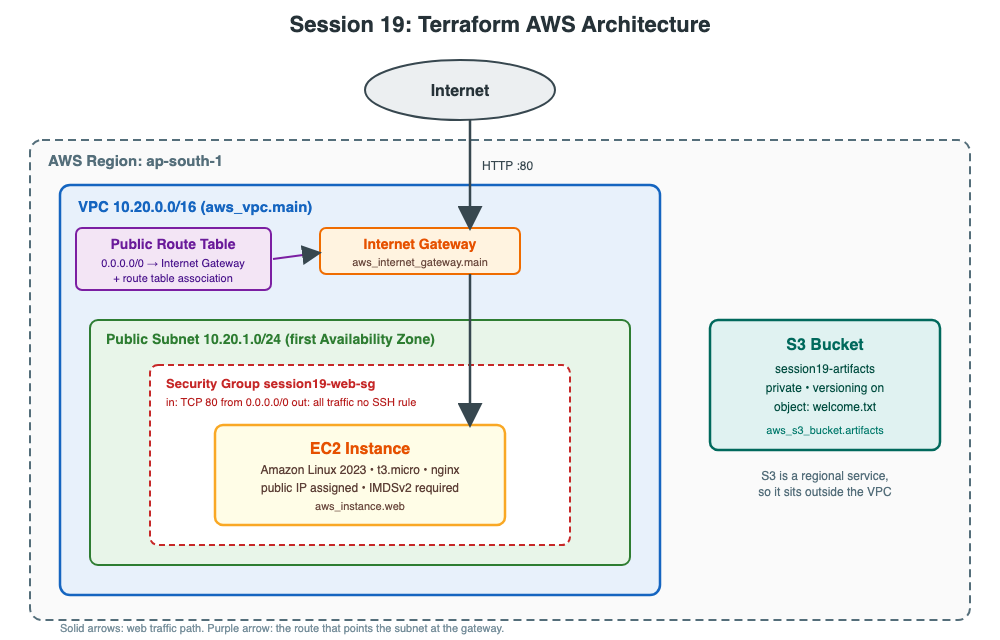
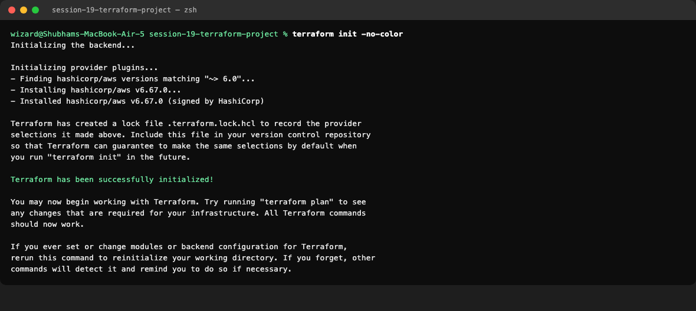

# Session 19: Cloud & Terraform in Action

**Name:** Shubham Shah  
**Roll Number:** 10316

An end-to-end AWS project built entirely with Terraform. One `terraform apply` creates a network, a firewall, a web server and a storage bucket. One `terraform destroy` removes all of it.

## Architecture



```
Internet ──► Internet Gateway ──► Public Subnet ──► Security Group ──► EC2 (nginx)
                  ▲                (10.20.1.0/24)    (TCP 80 only)
                  │
          Public Route Table             S3 bucket (private, versioned)
          (0.0.0.0/0 → IGW)              sits outside the VPC
```

## Project Structure

```
session-19-terraform-project/
├── provider.tf          # Terraform and AWS provider versions, region, default tags
├── variables.tf         # Input variables with types, defaults and validation
├── main.tf              # All resources and data sources
├── outputs.tf           # Values printed after apply
├── terraform.tfvars     # Values for the variables
├── architecture.svg     # Diagram source
├── architecture.png     # Diagram image
├── .terraform.lock.hcl  # Exact provider version (commit this)
├── .gitignore           # Keeps state and .terraform/ out of Git
├── screenshots/
└── README.md
```

## What Gets Created

| # | Resource | Terraform name | Purpose |
|---|---|---|---|
| 1 | VPC `10.20.0.0/16` | `aws_vpc.main` | The private network |
| 2 | Public subnet `10.20.1.0/24` | `aws_subnet.public` | Holds the web server |
| 3 | Internet gateway | `aws_internet_gateway.main` | Connects the VPC to the internet |
| 4 | Route table | `aws_route_table.public` | Sends internet traffic to the gateway |
| 5 | Route table association | `aws_route_table_association.public` | Attaches the route table to the subnet |
| 6 | Security group | `aws_security_group.web` | Allows only HTTP in |
| 7 | EC2 instance | `aws_instance.web` | nginx web server |
| 8 | S3 bucket | `aws_s3_bucket.artifacts` | Private storage |
| 9 | Public access block | `aws_s3_bucket_public_access_block.artifacts` | Keeps the bucket private |
| 10 | Bucket versioning | `aws_s3_bucket_versioning.artifacts` | Keeps old object versions |
| 11 | S3 object | `aws_s3_object.welcome` | A sample file in the bucket |

Two **data sources** only read from AWS and create nothing: the list of Availability Zones, and the latest Amazon Linux 2023 image.

---

## Terraform Concepts Used

### Providers

`provider.tf` tells Terraform to use the `hashicorp/aws` plugin at version 6.x. `terraform init` downloads it. The provider also sets `default_tags`, so every resource that supports tags receives `Project`, `ManagedBy` and `Session` automatically. No credentials are written in the code.

### Variables

`variables.tf` declares inputs with a type, a description and often a default. `terraform.tfvars` supplies the actual values. The `bucket_name` variable has a **validation** rule, so a bad name fails at plan time instead of during creation.

### Resources

Each `resource "TYPE" "NAME"` block describes one real object. Resources refer to each other with `TYPE.NAME.ATTRIBUTE`, for example `aws_vpc.main.id`.

### Outputs

`outputs.tf` prints useful values after apply, such as the instance public IP and the website URL. `terraform output` shows them again at any time.

### Dependencies

Terraform builds a dependency graph and creates resources in the right order.

| Kind | Example in this project |
|---|---|
| **Implicit**, from a reference | The subnet uses `aws_vpc.main.id`, so the VPC is created first. |
| **Explicit**, with `depends_on` | The instance lists the internet gateway and the route table association. It never references them, but its startup script needs internet access to install nginx. |

On destroy, the order is reversed.

### State

Terraform records every resource it created in `terraform.tfstate`. It compares that file with your code to decide what to add, change or delete. The file can contain sensitive values, so it is in `.gitignore`. In a team it is stored remotely, for example in S3.

---

## Prerequisites

### Tools and credentials

```bash
terraform version
aws sts get-caller-identity
```

### Permissions needed

The AWS user needs permission to create and read VPC, EC2 and S3 resources. A read-only user fails. The `plan` step also needs `ec2:DescribeAvailabilityZones` and `ec2:DescribeImages` because of the two data sources.

### Region

The resources go to `ap-south-1` because of `terraform.tfvars`. The AWS CLI may default to another region, so set the same region for the verification commands.

```bash
export AWS_DEFAULT_REGION=ap-south-1
```

### Cost

The VPC pieces and security group are free. The EC2 instance and its public IPv4 address are billed by the hour, and S3 costs almost nothing while nearly empty. Always run `terraform destroy` when you finish. Check which instance types your account's free tier covers and change `instance_type` in `terraform.tfvars` if needed.

---

## Workflow

Run all commands from inside this folder.

```bash
cd session-19-terraform-project
```

### 1. terraform init

Downloads the AWS provider and creates `.terraform.lock.hcl`.

```bash
terraform init
```



### 2. terraform fmt

```bash
terraform fmt
```


### 3. terraform validate

```bash
terraform validate
```


### 4. terraform plan

Shows everything that would be created, without creating it.

```bash
terraform plan
```


**Observation:** The plan ends with `Plan: 11 to add, 0 to change, 0 to destroy.` Values shown as `(known after apply)`, such as IDs, are decided by AWS during creation.

### 5. terraform apply

Creates everything after you type `yes`.

```bash
terraform apply
```


**Observation:** The log shows the order Terraform used. The VPC comes first, the subnet and gateway follow, and the instance is created only after the gateway and route association exist.

### 6. Inspect the state

```bash
terraform state list
terraform state show aws_instance.web
```


### 7. terraform output

```bash
terraform output
terraform output -raw website_url
```


### 8. Open the web server

The instance needs one to two minutes after `apply` to install nginx.

```bash
curl "$(terraform output -raw website_url)"
```

Or open the URL in a browser.


### 9. Verify in AWS with the CLI

Confirm the resources exist using the AWS CLI, independently of Terraform.

```bash
aws ec2 describe-vpcs --filters Name=tag:Name,Values=session19-vpc \
  --query 'Vpcs[].{Id:VpcId,Cidr:CidrBlock}' --output table

aws ec2 describe-instances --filters Name=tag:Name,Values=session19-web Name=instance-state-name,Values=running \
  --query 'Reservations[].Instances[].{Id:InstanceId,Type:InstanceType,State:State.Name,PublicIp:PublicIpAddress}' --output table

aws ec2 describe-security-groups --filters Name=group-name,Values=session19-web-sg \
  --query 'SecurityGroups[].IpPermissions[].{Port:FromPort,Protocol:IpProtocol,Source:IpRanges[0].CidrIp}' --output table

aws ec2 describe-route-tables --filters Name=tag:Name,Values=session19-public-rt \
  --query 'RouteTables[].Routes[].{Destination:DestinationCidrBlock,Target:GatewayId}' --output table

aws s3 ls | grep session19
aws s3 ls s3://shubham-10316-session19-artifacts/
```


**Observation:** The security group has one rule, TCP 80. The route table sends `0.0.0.0/0` to the internet gateway. The bucket holds `welcome.txt`.

### 10. Plan the destroy

```bash
terraform plan -destroy
```


### 11. terraform destroy

```bash
terraform destroy
```


Confirm nothing is left.

```bash
terraform state list
aws ec2 describe-vpcs --filters Name=tag:Name,Values=session19-vpc --query 'Vpcs[].VpcId'
aws s3 ls | grep session19
```


**Observation:** The state is empty, the VPC query returns an empty list and the bucket is gone. `force_destroy = true` let Terraform delete the bucket even though it held an object and old versions.

---

## Command Summary

| Command | What it does | Changes AWS? |
|---|---|---|
| `terraform init` | Downloads providers | No |
| `terraform fmt` | Formats the code | No |
| `terraform validate` | Checks the code | No |
| `terraform plan` | Previews changes | No |
| `terraform apply` | Creates or updates resources | Yes |
| `terraform state list` | Lists tracked resources | No |
| `terraform state show NAME` | Shows one resource's details | No |
| `terraform output` | Prints output values | No |
| `terraform destroy` | Deletes everything | Yes |

## Security Choices

- **No SSH rule.** Port 22 is closed, so the server cannot be logged into from the internet. Only HTTP is open.
- **IMDSv2 required.** The instance metadata service demands a session token, which blocks a common credential theft attack.
- **Encrypted root volume** using gp3 storage.
- **Private bucket.** All four public access settings are on, and versioning protects against accidental deletes.
- **No secrets in code.** The AWS keys stay in the CLI configuration, and the state file is not committed.

## Key Learnings

- One set of code builds a whole environment, and `destroy` removes all of it, so nothing is forgotten and billed.
- **References create dependencies.** Terraform orders everything itself, and `depends_on` covers dependencies it cannot see.
- **Data sources** read existing information, such as the newest AMI, so no ID is hard coded.
- **Variables** keep the code reusable. Change `terraform.tfvars` to build a different copy.
- **State** is how Terraform knows what exists. Losing it, or editing it by hand, causes trouble.
- **Always preview.** Read the plan before `apply` and `plan -destroy` before `destroy`.
