# Monitoring Demo: Prometheus, Grafana and Alerts

**Name:** Shubham Shah  
**Roll Number:** 10316

A small web app is watched by Prometheus and Grafana. The demo shows **metrics, logs, alerts, CPU usage, memory usage and application health**, and what each one looks like when the app is healthy, overloaded and down.

## What is Monitoring?

Monitoring means collecting numbers about a system, showing them on dashboards, and raising an alert when something looks wrong. It answers the question: **is the system healthy right now?**

| What we watch | Where it comes from in this demo |
|---|---|
| **Metrics**: request count, errors, latency | The app's `/metrics` endpoint |
| **Logs**: one line per event | The app's standard output, read with `docker compose logs` |
| **Alerts**: a rule that notices a problem | Rules in `prometheus/alerts.yml` |
| **CPU utilization** | `process_cpu_seconds_total` (app) and `node_cpu_seconds_total` (host) |
| **Memory utilization** | `process_resident_memory_bytes` (app) and `node_memory_*` (host) |
| **Application health** | The `up` metric, which is 1 when Prometheus can scrape the app |

## Architecture

```
                 scrapes /metrics every 5s
        ┌─────────────────────────────────────────┐
        │                                         │
 ┌──────┴───────┐   ┌──────────────┐   ┌──────────▼─────────┐   queries   ┌───────────┐
 │  demo app    │   │ node-exporter│   │    Prometheus      │◄────────────│  Grafana  │
 │  (Flask)     │   │ host CPU/mem │   │ stores metrics     │             │ dashboard │
 │  :8000       │   └──────▲───────┘   │ evaluates alerts   │             │  :3000    │
 └──────────────┘          └───────────│ :9090              │             └───────────┘
                                       └────────────────────┘
```

Prometheus **pulls** (scrapes) metrics from each target on a schedule. Grafana only displays them, by sending queries to Prometheus.

## Folder Structure

```
01-monitoring/
├── docker-compose.yml                    # app, node-exporter, Prometheus, Grafana
├── load.sh                               # sends normal, error, slow or CPU-heavy traffic
├── app/
│   ├── app.py                            # Flask app that exposes /metrics
│   ├── requirements.txt
│   └── Dockerfile
├── prometheus/
│   ├── prometheus.yml                    # what to scrape, where the alert rules are
│   └── alerts.yml                        # 5 alert rules
├── grafana/
│   ├── provisioning/datasources/         # connects Grafana to Prometheus automatically
│   ├── provisioning/dashboards/          # loads the dashboard automatically
│   └── dashboards/app-monitoring.json    # the 12-panel dashboard
└── screenshots/
```

## The demo app

| Endpoint | What it does | Used to show |
|---|---|---|
| `/` | Returns a greeting | Normal traffic |
| `/health` | Returns `UP` | A health check |
| `/error` | Returns HTTP 500 and logs an error | Error rate and error logs |
| `/slow` | Waits 1.2 to 2 seconds | Latency |
| `/cpu` | Burns CPU for one second | CPU usage |
| `/metrics` | Prometheus-format metrics | The source of all metrics |

The app records two custom metrics: `http_requests_total` (a counter, labelled by endpoint and status) and `http_request_duration_seconds` (a histogram of response times). The Prometheus client library adds CPU and memory metrics for the app process automatically.

## Alert rules

| Alert | Fires when | For |
|---|---|---|
| `AppDown` | The app target cannot be scraped (`up == 0`) | 15s |
| `HighErrorRate` | More than 20% of requests return 5xx | 30s |
| `HighLatency` | The 95th percentile response time is above 1 second | 30s |
| `HostHighCPU` | Host CPU is above 80% | 1m |
| `HostHighMemory` | Host memory is above 85% | 1m |

The `for` time stops a short spike from raising an alert. Here it is kept short so the demo fires quickly. An alert is **inactive**, then **pending** while the condition holds, then **firing** once the `for` time has passed.

---

## Run the Demo

Docker must be running. Run all commands from inside `01-monitoring/`.

```bash
cd session-20-monitoring-gitops/01-monitoring
docker compose up -d --build
docker compose ps
```

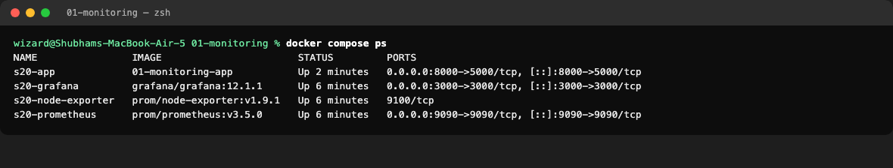

| Service | URL | Login |
|---|---|---|
| Demo app | http://localhost:8000 | none |
| Prometheus | http://localhost:9090 | none |
| Grafana | http://localhost:3000 | `admin` / `admin` |

The app is on port 8000 because macOS already uses port 5000 for AirPlay.

### 1. Check that Prometheus can see every target

Open http://localhost:9090/targets.

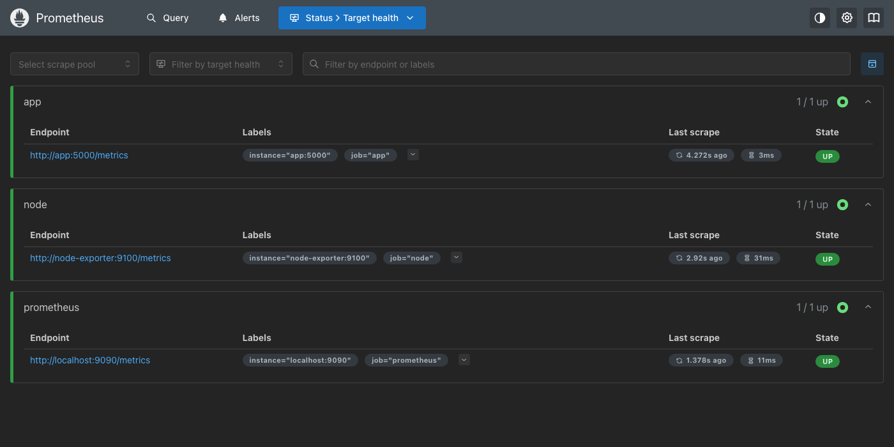

**Observation:** All three targets show `UP`. This is application health from Prometheus's point of view.

### 2. Look at the raw metrics and the logs

```bash
curl -s localhost:8000/metrics | grep -E "^(http_requests_total|process_cpu_seconds_total|process_resident_memory_bytes)"
```

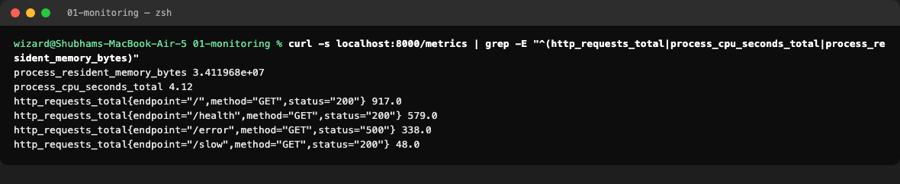

```bash
docker compose logs app --tail 14
docker compose logs app | grep ERROR | tail -3
```

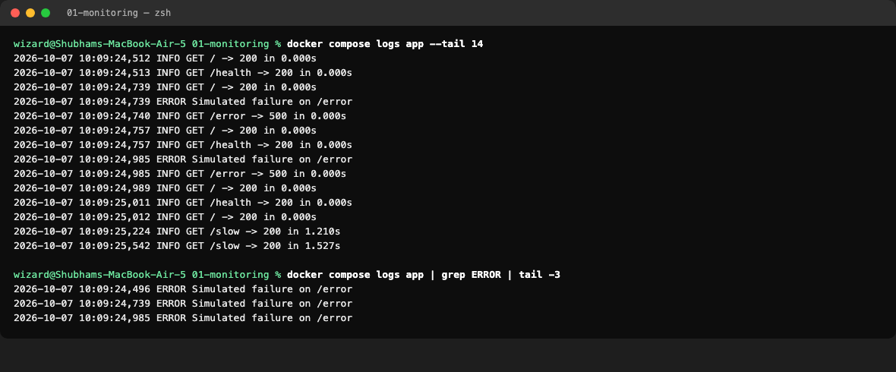

**Observation:** Metrics are numbers that summarize behaviour. Logs are individual events. The `ERROR` lines show exactly which request failed, which a counter cannot tell you.

### 3. Send traffic and query it with PromQL

```bash
./load.sh normal 60
```

In Prometheus, open **Query** and run:

```
sum by (endpoint) (rate(http_requests_total[1m]))
```

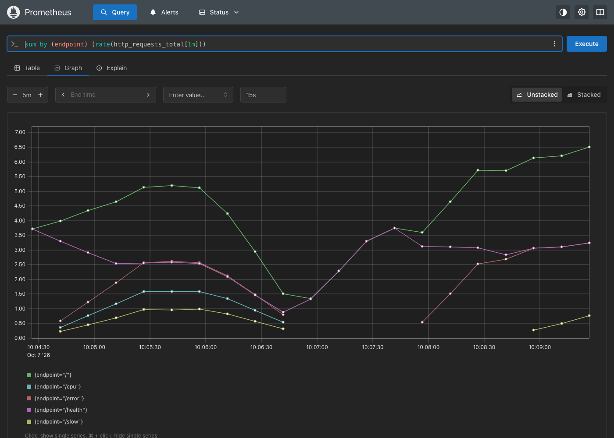

`rate(...[1m])` turns an ever-increasing counter into "requests per second over the last minute", and `sum by (endpoint)` adds the series together for each endpoint.

### 4. Open the Grafana dashboard

Open http://localhost:3000, sign in, and go to **Dashboards > Session 20 Application Monitoring**. It was loaded automatically from `grafana/dashboards/`.

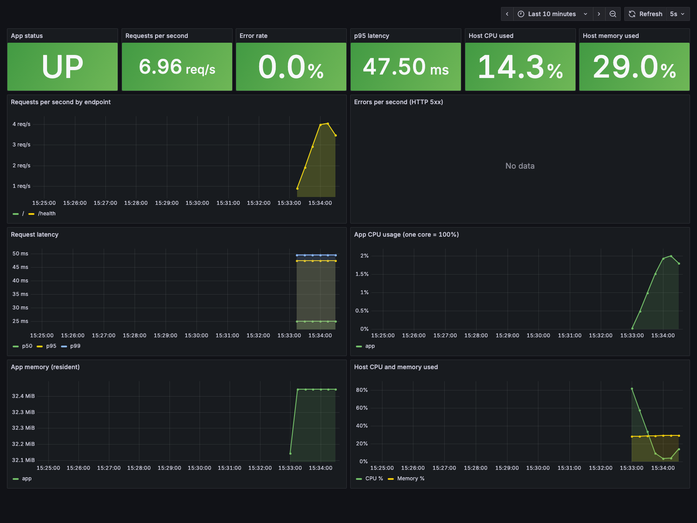

**Observation:** The app is `UP`, the error rate is 0%, latency is a few tens of milliseconds, and host CPU and memory are normal.

| Panel | Query idea | Golden signal |
|---|---|---|
| App status | `up{job="app"}` | Availability |
| Requests per second | `sum(rate(http_requests_total[1m]))` | Traffic |
| Error rate | 5xx requests divided by all requests | Errors |
| p95 latency | `histogram_quantile(0.95, ...)` | Latency |
| App CPU, memory | `process_cpu_seconds_total`, `process_resident_memory_bytes` | Saturation |
| Host CPU, memory | `node_cpu_seconds_total`, `node_memory_*` | Saturation |

### 5. Check that no alerts are firing

Open http://localhost:9090/alerts.

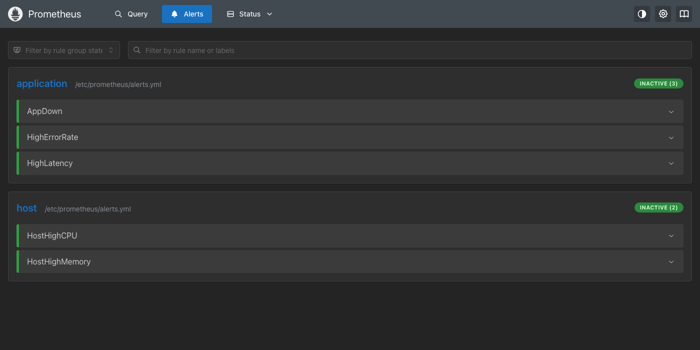

### 6. Cause problems and watch the alerts

Run these three at the same time, in separate terminals or in the background.

```bash
./load.sh errors 90 &
./load.sh slow 90 &
./load.sh cpu 90 &
```

Wait about a minute, then reload the alerts page.

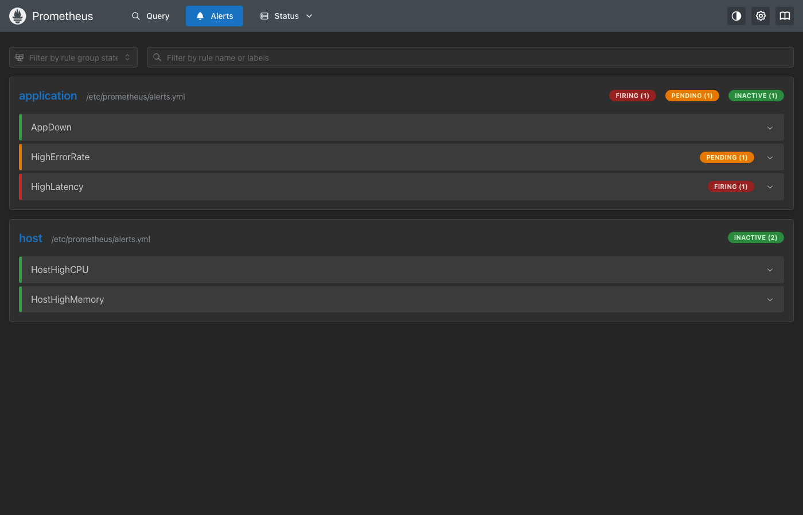

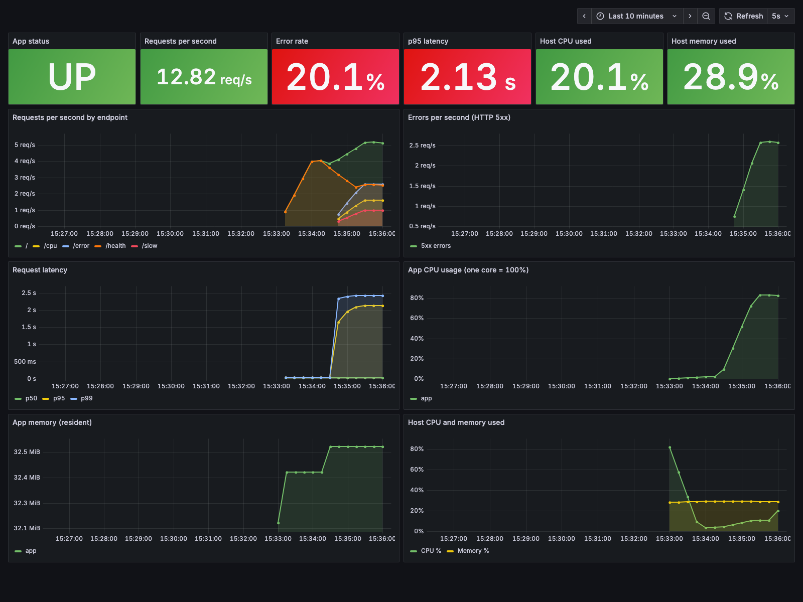

**Observation:** The error rate tile turns red, p95 latency climbs above 2 seconds, and app CPU rises sharply. The failing endpoints show up as separate lines in the requests chart. Alerts moved from inactive to pending to firing.

### 7. Stop the app

```bash
docker compose stop app
```

Wait 30 seconds.

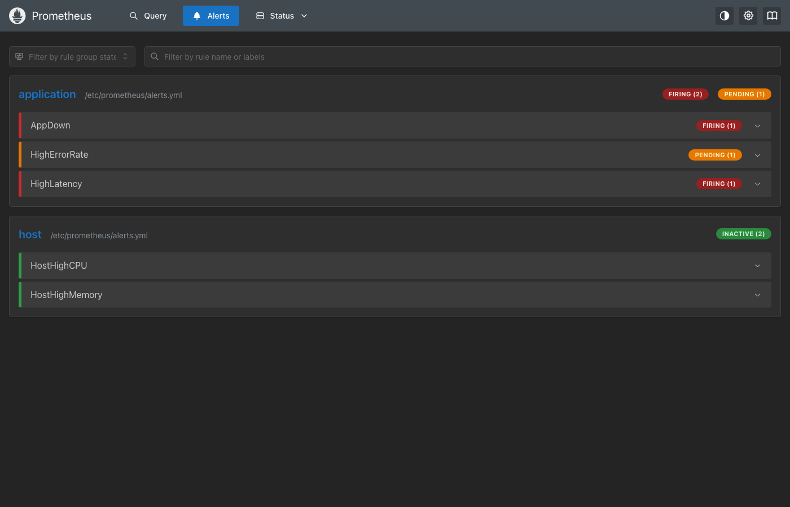

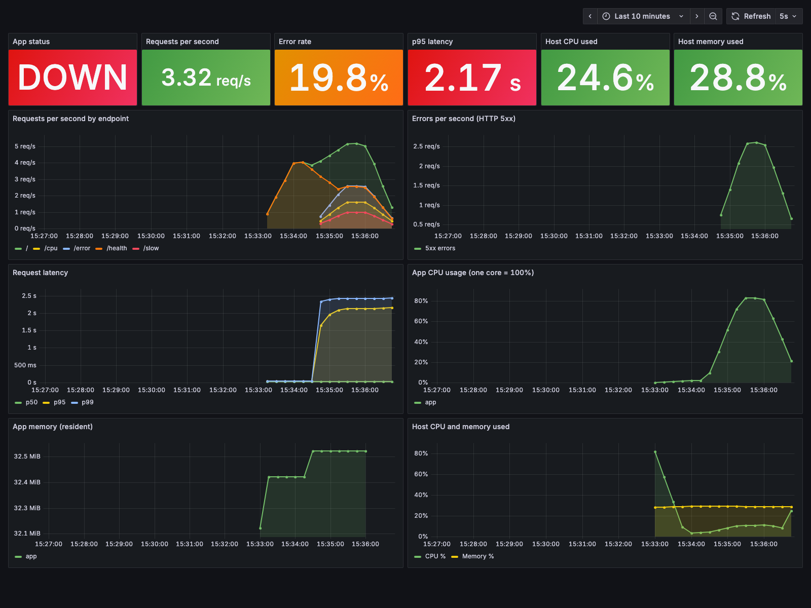

**Observation:** The `up` metric drops to 0, the status tile shows `DOWN`, and `AppDown` fires. No request failed in the logs, because the app is not running at all. This is why monitoring checks the target itself and not only the traffic.

### 8. Bring it back

```bash
docker compose start app
./load.sh normal 60
```

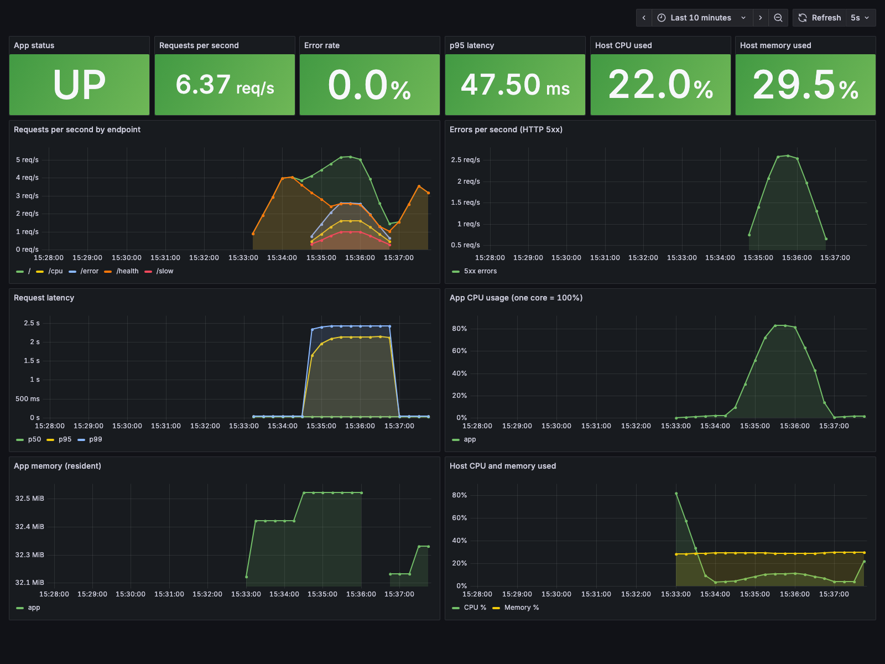

**Observation:** The status returns to `UP`, and the alerts clear once the conditions stop being true.

### Clean up

```bash
docker compose down -v
```

---

## Troubleshooting

| Problem | Cause and fix |
|---|---|
| Port 5000 is already in use | macOS AirPlay Receiver uses it. The app is published on 8000 to avoid that. |
| A target shows `DOWN` | Run `docker compose ps` and `docker compose logs <service>`. |
| Grafana panels show "No data" | Send traffic first. A `rate()` needs a minute of data. |
| Host CPU and memory look like a different machine | On Docker Desktop, node-exporter reports on the Linux VM that runs Docker, not on macOS itself. |

## Key Learnings

- **Prometheus pulls** metrics from `/metrics` endpoints. It stores them as time series.
- A **counter** only goes up, so use `rate()` to see it as speed. A **histogram** lets you ask for percentiles such as p95.
- **Averages hide problems.** The p95 and p99 latency lines showed the slow requests that the p50 line did not.
- **Alerts need a `for` time** so that a brief spike does not wake anyone up.
- **Logs and metrics answer different questions.** Metrics tell you something is wrong. Logs tell you what happened.
- The **`up` metric** is the simplest health signal, and it is the only one that notices a service that has died.
