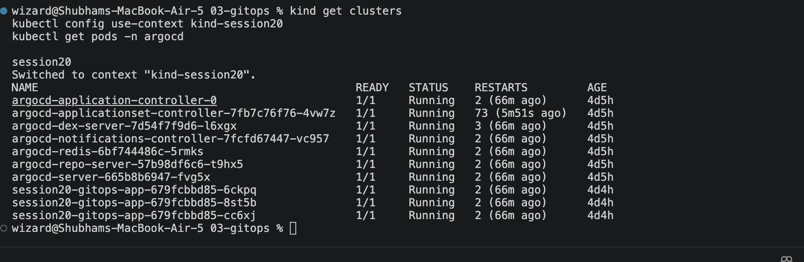

# GitOps with Argo CD

**Name:** Shubham Shah  
**Roll Number:** 10316

## What is GitOps?

**GitOps** is a way of running infrastructure and applications where **Git is the single source of truth** for what should be running. You change the system by changing files in Git. A tool inside the cluster notices the change and makes the real cluster match.

### Core ideas

| Idea | Meaning |
|---|---|
| **Git as the source of truth** | The desired state of the system lives in a Git repository. Nobody edits the cluster by hand. |
| **Declarative configuration** | Files describe *what* you want (3 replicas), not *how* to get there. Kubernetes YAML is declarative. |
| **Versioned and auditable** | Every change is a commit with an author, a message and a diff. |
| **Pull-based delivery** | An agent inside the cluster pulls changes from Git. The cluster does not need to be reachable from outside. |
| **Continuous reconciliation** | The agent keeps comparing the live cluster with Git and fixes any difference. |

### Reconciliation loop

```
        ┌────────────┐   pull    ┌──────────────┐   apply   ┌───────────────┐
 push   │    Git     │──────────►│   Argo CD    │──────────►│   Kubernetes  │
───────►│ (desired)  │           │ (compares)   │           │   (actual)    │
        └────────────┘           └──────▲───────┘           └───────┬───────┘
                                        └──── drift detected ───────┘
```

If the two differ, Argo CD marks the app **OutOfSync** and, with automation on, syncs it.

### Why it helps

- **Easy rollback.** `git revert` and the cluster returns to the earlier state.
- **No drift.** A manual change in the cluster is detected and undone (self-heal).
- **Better security.** CI does not need cluster credentials, because the cluster pulls.
- **Clear history.** Git log shows who changed what, when and why.
- **Disaster recovery.** Rebuild a cluster by pointing a new Argo CD at the same repo.

### Kubernetes and GitOps

| | Traditional CI/CD (push) | GitOps (pull) |
|---|---|---|
| Who deploys | The pipeline runs `kubectl apply` | An agent in the cluster applies from Git |
| Cluster credentials | Stored in the pipeline | Stay inside the cluster |
| Manual changes | Stay until the next deploy | Reverted automatically |
| Source of truth | The pipeline and the cluster | Git |

The two common tools are **Argo CD** (used here, with a web UI) and **Flux**. A typical flow: CI builds an image and commits the new image tag to the config repo, and Argo CD then rolls it out.

---

## What this demo deploys

```
03-gitops/
├── app/                          # The folder Argo CD watches in Git
│   ├── namespace.yaml            # Namespace session20-gitops
│   ├── deployment.yaml           # nginx, replicas: 2
│   └── service.yaml              # ClusterIP service
├── argocd-application.yaml       # Tells Argo CD what to watch and where to deploy
├── screenshots/
└── README.md
```

`argocd-application.yaml` is kept **outside** `app/` on purpose. If it were inside, Argo CD would try to manage its own definition.

The Application points at this homework repository itself, so no separate repo is needed:

| Field | Value |
|---|---|
| `repoURL` | `https://github.com/Shubhamm-02/DevOps.git` |
| `path` | `session-20-monitoring-gitops/03-gitops/app` |
| `targetRevision` | `main` |
| Destination | namespace `session20-gitops` in the same cluster |
| `automated.prune` | Deletes cluster objects that were removed from Git |
| `automated.selfHeal` | Reverts manual changes made in the cluster |
| `CreateNamespace` | Creates the namespace if it is missing |

---

## Step by step

Run commands from the repository root unless stated otherwise.

### 1. Check the cluster and Argo CD

This uses the kind cluster named `session20` that already has Argo CD installed.

```bash
kind get clusters
kubectl config use-context kind-session20
kubectl get pods -n argocd
```



If `argocd-applicationset-controller` is in `CrashLoopBackOff`, restart it. It is not needed for this demo.

```bash
kubectl rollout restart deployment argocd-applicationset-controller -n argocd
```

<details>
<summary>If Argo CD is not installed yet</summary>

```bash
kind create cluster --name session20
kubectl create namespace argocd
kubectl apply -n argocd --server-side --force-conflicts \
  -f https://raw.githubusercontent.com/argoproj/argo-cd/stable/manifests/install.yaml
kubectl get pods -n argocd -w
```

`--server-side` avoids an error caused by very large CRD annotations.
</details>

### 2. Push the manifests to GitHub

Argo CD reads from GitHub, so the files must be pushed first.

```bash
git add session-20-monitoring-gitops
git commit -m "Add Session 20 monitoring and GitOps demo"
git push
```

### 3. Register the application

```bash
kubectl apply -f session-20-monitoring-gitops/03-gitops/argocd-application.yaml
kubectl get applications -n argocd
```

Wait until `session20-gitops-app` shows `Synced` and `Healthy`.

```bash
kubectl get applications -n argocd -w
```


### 4. See what Argo CD deployed

```bash
kubectl get all -n session20-gitops
```


**Observation:** Nothing was applied by hand. Argo CD created the namespace, the Deployment with 2 replicas and the Service, all from the files in Git.

### 5. Open the Argo CD interface

```bash
kubectl -n argocd get secret argocd-initial-admin-secret -o jsonpath="{.data.password}" | base64 -d && echo
kubectl port-forward svc/argocd-server -n argocd 8080:443
```

Open https://localhost:8080, accept the certificate warning, and sign in as `admin` with the password printed above.


Click `session20-gitops-app` to see the resource tree.


### 6. Change the system through Git

Change the replica count from 2 to 3 **in the file**, not in the cluster.

```bash
sed -i '' 's/replicas: 2/replicas: 3/' session-20-monitoring-gitops/03-gitops/app/deployment.yaml
git diff
git add session-20-monitoring-gitops/03-gitops/app/deployment.yaml
git commit -m "Scale session20 app to three replicas"
git push
```

Argo CD checks Git about every 3 minutes. To see it right away, ask it to refresh.

```bash
kubectl annotate application session20-gitops-app -n argocd argocd.argoproj.io/refresh=hard --overwrite
kubectl get deployment session20-gitops-app -n session20-gitops -w
```


**Observation:** The change made in Git reached the cluster without any `kubectl apply`. That is continuous delivery through reconciliation.

### 7. Self-healing: undo a manual change

Change the cluster directly, bypassing Git.

```bash
kubectl scale deployment session20-gitops-app -n session20-gitops --replicas=1
kubectl get pods -n session20-gitops -w
```


**Observation:** Within moments the replicas return to 3. Git says 3, so Argo CD treats the manual change as drift and corrects it. The only way to change the system is through Git.

### 8. Roll back with Git

```bash
git revert --no-edit HEAD
git push
kubectl annotate application session20-gitops-app -n argocd argocd.argoproj.io/refresh=hard --overwrite
kubectl get deployment session20-gitops-app -n session20-gitops -w
```

![Git revert and the deployment returning to 2 replicas]

**Observation:** A rollback is just another commit. Reverting the scale-up commit brought the replicas back to 2.

### 9. Clean up

The finalizer on the Application means deleting it also removes everything it deployed.

```bash
kubectl delete -f session-20-monitoring-gitops/03-gitops/argocd-application.yaml
kubectl get all -n session20-gitops
```


---

## Troubleshooting

| Symptom | Likely cause and fix |
|---|---|
| Application shows `Unknown` and a path error | The files are not pushed yet, or the `path` or `repoURL` is wrong. Push, then check `kubectl describe application session20-gitops-app -n argocd`. |
| `OutOfSync` but it never syncs | Check that `syncPolicy.automated` is present, or sync manually from the UI. |
| Change in Git does not appear | Argo CD polls every 3 minutes. Use the `refresh=hard` annotation. |
| Manual change is not reverted | `selfHeal: true` must be set in the Application. |
| `argocd-applicationset-controller` crashes | Run the `rollout restart` command in step 1. |
| Cannot reach the UI | Keep the `port-forward` terminal open, and use `https://` on port 8080. |

## Key Learnings

- **Git is the source of truth.** The cluster should always match what is committed.
- **Declarative files** describe the desired state. Kubernetes and Argo CD do the work of reaching it.
- **Reconciliation never stops.** Drift in the cluster is detected and corrected automatically.
- **Rollback is a `git revert`**, with a full audit trail of who changed what.
- **Pull-based delivery** keeps cluster credentials inside the cluster.
- **Keep the Application definition outside the watched folder**, so Argo CD does not manage itself.
